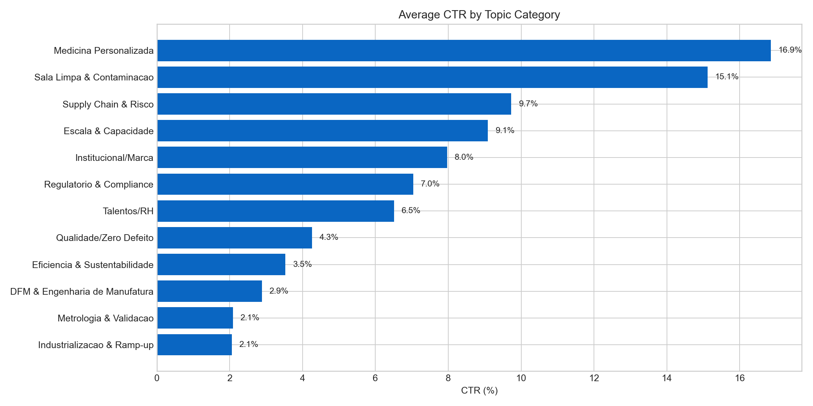
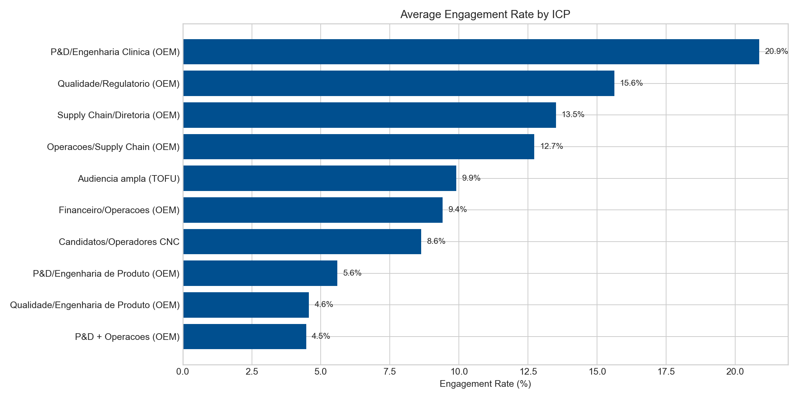
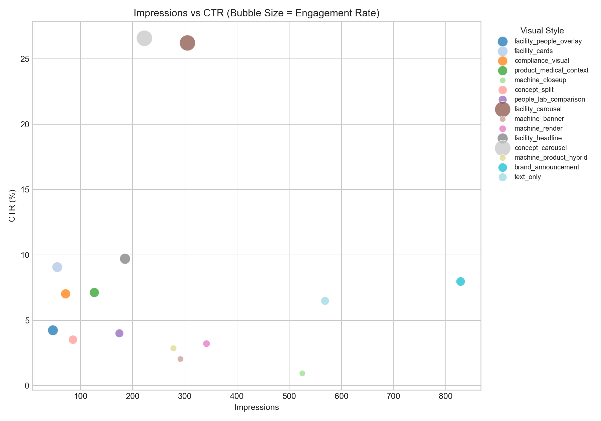
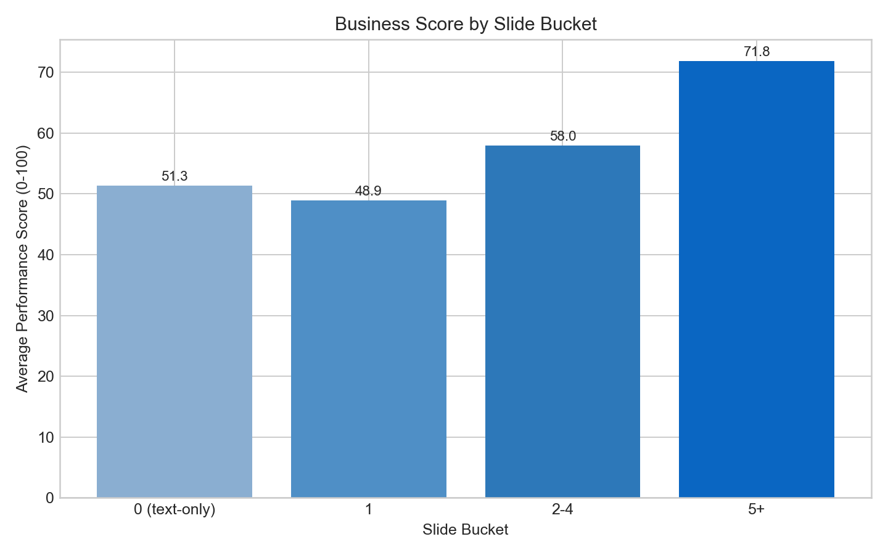

# LinkedIn Analytics Report (Lifetrek)

## Files
- CSV: `linkedin_post_analytics_scored.csv`
- Visuals: `viz_01` to `viz_04`

## Visualizations

### 1) Average CTR by Topic

### 2) Average Engagement Rate by ICP

### 3) Impressions vs CTR (bubble = engagement)

### 4) Business Score by Slide Bucket

