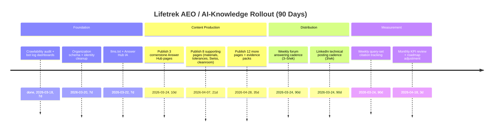

# Answer Engine Optimization Strategy for Lifetrek Medical in Precision Medical Manufacturing

## Executive summary

Lifetrek Medical already has strong “answer-engine-ready” raw material—clear claims around ISO 13485 + ANVISA certification, Swiss CNC machining, ISO 7 cleanroom manufacturing, UDI laser marking, and end-to-end traceability—showing up across its website snippets and its company presence on entity["company","LinkedIn","professional social network"].citeturn18search0turn18search4 The fastest path to winning “AI-cited” visibility is to turn those capabilities into a structured, evidence-dense “Answer Hub” (on-site) and then seed high-intent Q&A surfaces (off-site) with repeatable answer patterns that LLM-based engines can safely reuse, cite, and verify via crawlable sources. This must be paired with a technical crawlability program oriented around the actual crawlers used by ChatGPT Search (OAI-SearchBot) and Perplexity (PerplexityBot), plus log-based measurement and attribution strategies that work even when AI engines do not reliably pass referral data.citeturn9view0turn9view1turn9view2

Two constraints shape this plan: (1) Quora could not be directly reviewed with the current research tooling because it blocks automated access, so the “Quora” portion is strategy + templates rather than a full empirical audit; (2) Lifetrek’s web pages could not be content-parsed by this tool (0 extracted lines), which may indicate heavy client-side rendering or bot defenses—this must be validated using Lifetrek’s own server logs against known AI crawler user agents and IP ranges.citeturn14search2turn2view0

## Current Lifetrek content and entity signals

Publicly visible signals indicate Lifetrek Medical is positioned as a high-precision, Brazil-based OEM/contract manufacturer for medical/dental/veterinary implants and instruments, with ISO 13485 and ANVISA certification, Swiss CNC machining, and ISO 7 cleanroom manufacturing referenced in search snippets and the “What we do” page snippet.citeturn18search0turn18search2 The company’s entity["company","LinkedIn","professional social network"] page provides strong operational and compliance language (e.g., ISO 13485 alignment, UDI marking durability, full batch traceability, Citizen L20/M32 Swiss machines, Zeiss CMM inspection, cleanroom protocols) that can be repurposed into canonical “answer pages” on the website.citeturn18search4 Lifetrek also appears active on entity["company","Instagram","social media platform"], which can help discovery and recency signals, though Instagram content is less reliably citable than crawlable technical pages.citeturn18search1

A critical entity risk: the name space around “Lifetrek / Lifetrack / LifeTrek” is noisy, and search results show unrelated similarly named companies. That increases the chance AI engines conflate entities unless Lifetrek strengthens disambiguation across structured data, consistent naming (“Lifetrek Medical, Indaiatuba, Brazil”), and “sameAs” identity links.citeturn0search9turn20view1

**Entity signal baseline (public-facing)**

| Surface | What’s currently visible | AEO/AI-citation implication | Priority actions |
|---|---|---|---|
| lifetrek-medical.com | Snippets reference ISO 13485 + ANVISA, Swiss CNC machining, ISO 7 cleanroom; capability page snippet references ISO 7 cleanroom manufacturing (incl. “duas salas limpas de 60m²”).citeturn18search0turn18search3 | These are the exact claims procurement/QA/R&D ask about—high intent. Risk: if pages are JS-heavy or bot-blocked, answer engines may not be able to fetch them reliably.citeturn2view0turn9view0turn9view1 | Make core pages crawlable + renderable; create dedicated “Answer Hub” pages that are static, scannable, and richly structured. |
| LinkedIn company page | Clear positioning: Brazilian high-precision implants/instruments manufacturer; OEM contract manufacturing; ISO 13485; location in entity["city","Indaiatuba","sao paulo brazil"], entity["state","São Paulo","state brazil"], entity["country","Brazil","country"]; posts discuss UDI, cleanroom ISO 7, Swiss machining setups, Zeiss CMM, traceability.citeturn18search4 | LinkedIn is high-authority and frequently indexed; also a strong “corroboration source” for entity resolution and trust. | Convert best posts into on-site evergreen pages; align About + taglines + “proof points” to the same canonical phrasing. |
| Instagram | Active account with technical/educational content.citeturn18search1 | Helpful for human discovery; weaker for citations and long-term retrieval vs. HTML pages. | Use Instagram to point to canonical on-site explainers; keep technical claims anchored on the website. |

**Key assumption gaps (unknown)**  
Internal resources (writers, engineers available for SME review, ability to ship web changes, analytics maturity, and paid tooling budget) are not specified; the roadmap below assigns “owners” by function and includes effort estimates that should be adjusted once resourcing is confirmed.

## How AI answer engines cite and what that implies for strategy

Answer engines do not “crawl the web” in a single uniform way. Your AEO strategy must align to (a) automatic indexing crawlers used to surface sources and (b) user-triggered fetchers used at query time.

**ChatGPT Search mechanics (what matters for being cited)**  
ChatGPT Search rewrites user prompts into search queries and uses third-party search providers (including Bing) to retrieve results, then returns answers with inline citations and a “Sources” view.citeturn9view2turn9view3 OpenAI explicitly states inclusion requires allowing OAI-SearchBot to crawl your site and allowing traffic from published IP ranges; top placement cannot be guaranteed.citeturn9view2turn9view0

**OpenAI and Perplexity crawlers (what to configure and measure)**  
OpenAI’s documentation distinguishes:
- **OAI-SearchBot**: for surfacing sites in ChatGPT search results; robots.txt changes can take ~24 hours to reflect.citeturn9view0  
- **GPTBot**: used for training data collection (separate from search).citeturn9view0  
- **ChatGPT-User**: user-initiated browsing; may not follow robots.txt.citeturn9view0  

Perplexity similarly distinguishes:
- **PerplexityBot**: for indexing and surfacing sites in Perplexity search; robots.txt changes can take up to 24 hours to reflect.citeturn9view1  
- **Perplexity-User**: user-initiated fetcher; “generally ignores robots.txt.”citeturn9view1  

This has two strategic implications:
1) “Posting windows” are less important than **crawlability + clean source pages**—because the indexing loop is crawler-driven and the documented propagation window is on the order of ~24 hours for configuration changes, not minutes.citeturn9view0turn9view1  
2) Even if indexing is restricted, user-driven fetchers can still pull pages at runtime, so **the quality and safety of the page itself** (clear structure, no prompt-injection traps, no misleading hidden content) becomes part of your “AI readiness.”citeturn9view0turn9view1turn8news44  

**Robots.txt is guidance, not access control**  
Robots Exclusion Protocol (RFC 9309) clarifies robots.txt is not an authorization mechanism; it is a convention crawlers are requested to honor.citeturn10search5 This matters because some AI crawling behavior has been publicly disputed (e.g., entity["company","Cloudflare","web security and cdn company"] alleged “stealth crawling” by Perplexity).citeturn21search4turn21news39turn21news40 Your defensive posture should therefore include WAF controls and log verification—without assuming robots.txt alone will solve it.citeturn9view1turn10search5

**Structured identity is a compounding advantage**  
entity["company","Google","search engine company"] recommends Organization structured data to help disambiguate organizations and improve administrative details in search, including knowledge panels and logo selection.citeturn20view1 Because ChatGPT Search relies on web search infrastructure and entity resolution, this “classic” structured data work directly supports AEO outcomes.citeturn9view2turn20view1

**LLM-friendly content entry points are emerging**  
The /llms.txt proposal (Jeremy Howard) describes a standardized, markdown-based “recommended reading list” so LLM tools can more efficiently understand a site.citeturn13view0 entity["company","Anthropic","ai safety and research company"] explicitly references llms.txt as a common place to find LLM-friendly documentation.citeturn13view1 For Lifetrek, llms.txt is not a replacement for SEO/structured data; it is an additional “AI ingestion interface” that can accelerate correct grounding when agents fetch your site.

## High-intent question inventory and competitor citation patterns

### What buyers and engineers are already asking

Because Quora could not be directly reviewed here (tool access blocked), this inventory is built from entity["company","Reddit","social news forum platform"] and engineering/manufacturing forums that are accessible and commonly indexed.citeturn14search2turn16search0 The recurring themes map cleanly to Lifetrek’s claimed strengths: ISO 13485 expectations, sourcing qualification, tolerances and metrology, manufacturing reality (setups, variation), cleanroom and contamination control, and UDI/marking survivability.

**High-intent question clusters to target**

| Question cluster | Real-world examples (public) | Why it’s high-intent | Lifetrek “answer asset” to build |
|---|---|---|---|
| Supplier qualification for ISO 13485 work | Threads where commenters emphasize ISO 13485 certified contract manufacturers for regulated work.citeturn14search2turn15search1 | This is procurement + QA gatekeeping before RFQ. | “How to qualify a precision machining supplier under ISO 13485” (checklist + document list + audit questions). |
| “Can you really hold this tolerance?” + metrology | Discussions about machine capability and tight tolerances in CNC contexts.citeturn16search2turn15search4 | Engineers are deciding build-vs-buy or supplier change. | “Medical machining tolerances: what is realistic, what drives cost, and how we control variation” (SPC examples, CMM approach). |
| Swiss machining vs. conventional machining | Industry narratives describing Swiss-type lathes, guide bushings, ground stock, and medical component examples.citeturn15search3 | Directly tied to geometry feasibility + cost. | “When Swiss machining is the right choice for implants/instruments” (geometry patterns, DFM do/don’t). |
| Cleanroom class meaning in practice | Engineers ask practical differences between ISO 7 and ISO 8 operations.citeturn10search32turn10search26 | Cleanliness drives validation burden and risk. | “ISO 7 cleanroom manufacturing for devices: what it changes (and what it doesn’t)” (particle limits + process controls). |
| UDI and permanent marking durability | Regulatory guidance: direct marking required in specific reuse/reprocess contexts; device teams worry about marks surviving sterilization.citeturn10search3turn18search4 | Compliance + recall risk + audit pain. | “UDI laser marking that survives sterilization: design + process controls” (material-specific guidance, verification). |

### What competitor content tends to look like when it gets cited

Competitor sites that appear “built to be cited” share these traits:
- One page answers one buyer question (“ISO 7 cleanroom manufacturing,” “in-house electropolishing,” “ISO 13485 certified contract manufacturing”) with clear headings and declarative claims.citeturn17search3turn17search4turn0search13  
- Proof language is explicit (certifications, facility size, cleanroom class, regulatory registrations), which reduces ambiguity for answer engines.citeturn17search3turn0search13  
- “Hand-offs eliminated” is framed as risk reduction and lead-time acceleration (common in medtech outsourcing narratives).citeturn17search4turn18search4  

Concrete examples:
- entity["company","Autocam Medical","contract manufacturer mi us"] positions itself as a contract manufacturer of orthopedic implants/instruments and calls out ISO 13485/FDA status.citeturn0search13  
- entity["company","Cirtec Medical","medical device outsourcing company"] explicitly highlights in-house electropolishing and related finishing operations as a way to reduce hand-offs while meeting ISO 13485/ASTM expectations.citeturn17search4  
- Primo Medical Group’s cleanroom manufacturing page is a direct “ISO 7 + ISO 13485 + contract manufacturer” answer page.citeturn17search3  

### Fastest-surfacing question types for ChatGPT and Perplexity

Because ChatGPT Search rewrites prompts into “search-engine-like” queries and relies on search providers, the question types that surface fastest are those with (a) a clear lexical match to common queries and (b) pages that stand alone as authoritative answers.citeturn9view2turn9view3 For precision medical manufacturing, that typically means:

- **Regulatory definitions + requirements** (ISO 13485 scope; FDA alignment; UDI direct marking requirements).citeturn10search4turn10search12turn10search3  
- **Decision checklists** (“How to qualify a contract manufacturer,” “audit questions for a Swiss machining supplier”), because they map to buyer intent and are easy for LLMs to quote and enumerate.citeturn14search2turn15search1  
- **Failure-mode explainers** (e.g., why UDI marks degrade after sterilization; why setups create variation), because they often require synthesis and lead to citations for verification.citeturn18search4turn8news44  
- **Process comparisons** (Swiss vs. conventional turning; electropolishing vs. passivation; ISO 7 vs. ISO 8), because they match how people ask questions and how answer engines format outputs.citeturn15search3turn11search17turn10search26  

## The AEO content system Lifetrek should build to own technical mindshare

### The “Answer Hub” architecture

Build a dedicated on-site “Answer Hub” that turns Lifetrek’s real differentiators into canonical, citable pages. Each page should follow a consistent pattern:

1) **One-sentence answer** (definition/claim).  
2) **What it means for an OEM** (risk, cost, validation).  
3) **Evidence and process controls** (inspection method, traceability, cleanroom protocol, marking verification).  
4) **Constraints and disclaimers** (what depends on device class, customer requirements, regulatory jurisdiction).  
5) **RFQ-ready artifacts** (downloadable checklist, sample CoC fields, traceability data dictionary).

This aligns with how ChatGPT Search presents cited answers (inline citations + summarized claims) and how Perplexity structures evidence-first responses.citeturn9view2turn9view1

### Technical topics to own

AEO in this industry is less about “keywords” and more about owning the buyer’s validation path. Lifetrek should build authoritative pages around:

- **ISO 13485 in manufacturing operations** (scope, supplier controls, traceability, document expectations). ISO positions ISO 13485 as the internationally recognized QMS standard for medical device design and manufacture, and FDA’s QMSR incorporates ISO 13485:2016 by reference—making it a globally resonant anchor topic.citeturn10search4turn10search12  
- **UDI and direct marking survivability** (what triggers direct marking; how to validate marks; material-specific marking considerations).citeturn10search3turn18search4  
- **ISO 7 cleanroom manufacturing in device supply chains** (particle limits, gowning/access protocols, what operations belong in ISO 7 vs outside). For example, ISO 7 vs ISO 8 differences are often communicated via particle limits and air-change expectations in industry guidance.citeturn10search26turn18search4  
- **Swiss machining for implants/instruments** (why guide bushings reduce deflection; why ground stock matters; how setups affect variation).citeturn15search3turn18search4  
- **Surface finishing and cleanability**: electropolishing fundamentals and why it’s used (smoothing, deburring, corrosion resistance), tying to med-device cleanability narratives.citeturn11search17turn11search37turn17search4  
- **Medical-grade materials** buyers regularly ask about (Ti Grade 5, 316L, Co-Cr, Nitinol, PEEK). For PEEK specifically, biomedical literature highlights its attractive combination of mechanical performance, chemical resistance, and biocompatibility; industry sources also emphasize compatibility with sterilization methods.citeturn11search4turn11search8  

image_group{"layout":"carousel","aspect_ratio":"16:9","query":["Swiss-type CNC lathe machining medical implants","ISO 7 cleanroom medical device manufacturing","laser marking UDI on stainless steel medical device","electropolishing stainless steel medical device components"],"num_per_query":1}

### Preferred answer structure LLMs reuse

LLMs tend to reuse content that is:
- **Highly extractable** (clear headings, short declarative sentences, definitional first paragraph).  
- **Non-controversial and verifiable** (standards/regulatory references and unambiguous claims).  
- **Enumerated** (checklists, step-by-step qualification criteria).  
These patterns also align with structured-data guidance: Organization markup helps disambiguate the entity, while crawlability + indexing enable discovery.citeturn20view1turn9view2

A practical “LLM-reusable” template for Lifetrek’s Answer Hub pages:

**Definition / direct answer (40–60 words)**  
**Why this matters (3 bullets max, each 12–18 words)**  
**How it’s done in manufacturing (numbered steps)**  
**Common failure modes (3–5 items)**  
**What to ask your supplier (RFQ checklist)**  
**What Lifetrek provides (3 proof points + link to evidence page)**

### Posting windows and cadence that actually matter

Because indexing is crawler-driven and configuration changes propagate on ~24-hour windows, the most meaningful “cadence” lever is **consistent publication of new, crawlable pages** and **regular Q&A participation** that earns secondary citations and links.citeturn9view0turn9view1turn10search5

That said, for distribution on entity["company","LinkedIn","professional social network"] (where human engagement drives reach and therefore downstream copying/quoting), LinkedIn’s own marketing guidance highlights weekdays, especially Tuesday–Thursday, with mid-morning and lunchtime standing out.citeturn21search1 Use that as a starting hypothesis—not a rule.

**Recommended publishing rhythm (starting point)**
- On-site: 2 Answer Hub pages/week + 1 “evidence update” (case snippet, metrology photo essay, traceability glossary).  
- LinkedIn: 3 posts/week (Tue/Wed/Thu), each pointing to one Answer Hub URL (no link-dumps—one page per post).citeturn21search1turn18search4  
- Off-site Q&A/forums: 3–5 high-quality answers/week across medtech + machining communities; focus on threads that already rank/are indexed (older evergreen threads can outperform brand-new ones).citeturn14search2turn15search1turn16search2  

## KPIs, tracking, attribution, and risks

### Measurement framework

**Crawlability and indexing KPIs**
- Count of visits (and URLs requested) from **OAI-SearchBot** and **PerplexityBot** in server logs; confirm requests originate from published IP ranges.citeturn9view0turn9view1  
- Time-to-first-crawl for newly published Answer Hub pages (median, p90).  
- Index coverage proxies: Google Search Console clicks/impressions for Answer Hub URLs (still valuable because ChatGPT Search relies on web search providers).citeturn9view2turn9view3  

**AI visibility KPIs**
- “Citation share” in a fixed weekly test set: 30 queries spanning ISO 13485, ISO 7 cleanroom, UDI marking, Swiss machining tolerances, electropolishing. Track whether Lifetrek appears in citations and which competitor pages co-appear (your “citation neighborhood”).  
- Referral traffic from AI surfaces (when available): sources that include chat-based engines. (Expect incomplete attribution; treat it as directional.)

**Commercial KPIs**
- RFQ conversions originating from Answer Hub landing pages (form submissions, booked calls).  
- Sales cycle acceleration signals: fewer pre-RFQ clarification emails; higher-quality RFQ packages (more complete specs, fewer unknowns).

### Attribution strategies that work even when AI doesn’t send clean referrals

- **“Source block” at the end of every Answer Hub page**: a short, standardized paragraph that includes company name, city/country, and the specific capability claims on that page (helps verbatim reuse and reduces entity confusion). This directly addresses name-space confusion (“Lifetrek vs Lifetrack”) observed in search results.citeturn0search9turn20view1  
- **Unique, consistent phrasing for proof points** (e.g., “ISO 7 cleanroom manufacturing + full batch traceability + UDI laser marking validation”) repeated across pages and LinkedIn posts—so brand attribution survives paraphrasing.citeturn18search4  
- **Downloadable artifacts** (supplier audit checklist, traceability field glossary, inspection plan template) behind a light form—this creates measurable conversions even when AI citations are not trackable.

### Risks and limitations

- **Prompt-injection / search manipulation risk**: ChatGPT Search has been reported vulnerable to deceptive web content, which increases the importance of keeping Lifetrek’s pages clean, transparent, and free of hidden instructions or misleading markup.citeturn8news44  
- **Crawler compliance variance**: Robots.txt is not authorization, and there have been public disputes about crawler behavior; rely on logs + WAF/IP verification, not assumptions.citeturn10search5turn21search4turn21news39  
- **Regulatory overreach risk**: Avoid giving device-specific regulatory advice as if it were universal; always scope answers by jurisdiction and device classification, and cite primary regulators/standards bodies when stating requirements (e.g., FDA UDI direct marking).citeturn10search3turn10search12turn10search4  

## Prioritized execution roadmap with deliverables, owners, and effort

### Fourteen-day plan

| Deliverable | Owner | Effort (estimate) | Output |
|---|---:|---:|---|
| AI crawlability audit: robots.txt, sitemap.xml, server log tracking for OAI-SearchBot/PerplexityBot/GPTBot | Web/DevOps | 6–10 hours | Confirm bots can crawl key URLs; dashboards for bot hits.citeturn9view0turn9view1turn10search5 |
| Organization structured data + identity disambiguation (name, address, sameAs to LinkedIn/Instagram) | Web | 6–12 hours | Reduced entity confusion; stronger knowledge signals.citeturn20view1turn18search4 |
| Publish 3 “Answer Hub” cornerstone pages | Marketing + QA/Eng SME | 12–18 hours | (1) ISO 13485 supplier qualification checklist; (2) ISO 7 cleanroom manufacturing; (3) UDI laser marking survivability.citeturn10search4turn10search26turn10search3turn18search4 |
| Create /llms.txt (curated) + optional llms-full.txt | Web + Marketing | 4–8 hours | AI-readable site map for agents; aligns with emerging practice.citeturn13view0turn13view1 |
| Seed distribution: 6–10 high-quality answers on Reddit + engineering forums (no selling, just competence) | Marketing + SME | 6–10 hours | First off-site citations/backlinks; topic testing.citeturn14search2turn16search0turn16search2 |
| Measurement baseline: weekly query set + citation capture | Marketing Ops | 3–5 hours | “Citation share” baseline and competitor neighborhood map. |

### Ninety-day plan

**Content outputs (target)**  
- 20–30 Answer Hub pages, organized into 5 clusters: (1) QMS/ISO 13485, (2) Swiss machining + tolerances, (3) materials + finishing, (4) cleanroom + packaging/handling, (5) traceability + UDI.citeturn10search4turn15search3turn11search4turn10search26turn10search3  
- 6 “evidence packs” (sanitized case examples): before/after finishing, metrology snapshots, sample lot traceability fields, UDI verification approach.

**Distribution outputs (target)**  
- 40–60 off-site answers across forums/community threads; 12 LinkedIn technical posts/month pointing to one Answer Hub page each (start with Tuesday–Thursday mid-morning/lunch and adjust).citeturn21search1turn18search4  

**Technical outputs (target)**  
- Continuous log-based crawl monitoring; WAF allowlisting/verification for declared crawlers where needed; quarterly structured data validation.citeturn9view1turn9view0turn20view1  

### Platform and content-type impact table

| Content type | Where it lives | Expected AI-citation impact | Why | Risk |
|---|---|---|---|---|
| “One-question answer page” (evergreen) | Lifetrek website | High | Directly matches search-rewritten queries; easiest for LLMs to quote and cite.citeturn9view2turn18search2 | Requires crawlability; may fail if JS/bot-blocked.citeturn2view0turn9view0 |
| Supplier audit checklist (download) | Website + supportive PDF | High | Enumerations are frequently reused in answers; creates lead capture. | Over-gating reduces citation likelihood. |
| Technical LinkedIn post → one canonical page | LinkedIn | Medium–High | High authority distribution; reinforces entity trust.citeturn18search4turn21search1 | Ephemeral; lower citation persistence vs. on-site. |
| Reddit / forum answer | Reddit + forums | Medium | Indexed Q&A threads match longtail questions; shows practical credibility.citeturn14search2turn16search0turn15search1 | Must avoid promotional tone; community rules. |
| “Capability page” (Swiss/CMM/cleanroom) | Website | Medium | Converts once discovered; supports many answers as a citation.citeturn18search3turn18search4 | If too marketing-heavy, less quotable. |

### Sample AEO-optimized answers for Reddit and Quora-style threads

**Sample answer about qualifying an ISO 13485 contract manufacturer**  
If your device program requires an ISO 13485 supplier, treat supplier qualification like a risk-reduction exercise—not a checkbox. ISO 13485 is the global QMS standard for medical device design/manufacture, and in the U.S., FDA’s QMSR incorporates ISO 13485:2016 by reference, so auditors expect disciplined controls around documentation, traceability, and process consistency.citeturn10search4turn10search12  

A practical qualification approach: (1) confirm certification scope and last audit cycle, (2) request a traceability walkthrough (raw material → in-process inspection → final release), (3) ask how they control critical dimensions (CMM method, sampling plan, reaction plan), (4) verify contamination controls if the part is cleanliness-sensitive (e.g., ISO 7 operations), and (5) verify how they manage nonconformances and CAPA. This is the difference between “they say they’re compliant” and “they can survive your audit.”citeturn14search2turn10search26turn18search4  

**Sample answer about ISO 7 cleanroom vs ISO 8 and what changes operationally**  
In practice, the difference isn’t just “cleaner air”—it changes gowning, material flow, monitoring, and how you validate that contamination risk is controlled. A commonly cited benchmark is that ISO 7 has substantially tighter particle limits than ISO 8 (often discussed via ≥0.5 µm particle limits and higher air-change expectations).citeturn10search26turn10search32  

The buyer-side question to ask is: *Which steps truly need ISO 7?* For many programs, only final cleaning, inspection staging, packaging/handling, or assembly steps are in controlled environments. The best suppliers make this explicit and tie it to risk and validation, not marketing.citeturn18search4turn17search3  

**Sample answer about UDI laser marks failing after sterilization**  
If a UDI mark degrades after sterilization, it’s not a branding issue—it’s a compliance and traceability risk. FDA’s guidance explains that certain devices that must bear UDI on the label also need a permanent UDI mark on the device itself when intended for more than one use and intended to be reprocessed before each use.citeturn10search3  

Common root causes of degradation include incorrect mark type for the material, insufficient contrast for scanners after surface changes, or process steps (cleaning/passivation/sterilization) that alter the surface state. Treat UDI marking as a validated process: define acceptance criteria (readability + durability), test marks through your real sterilization/reprocessing cycle, and document by lot. That’s how you avoid audit pain later.citeturn18search4turn10search3  

**Sample answer about why “too many setups” create variation in implant machining**  
Each setup/re-fixturing step introduces new opportunities for stack-up error—especially when you’re chasing concentricity, fine threads, or internal features. That’s why Swiss-type machining is common for long, small-diameter parts: guide bushings support the workpiece at the cut, reducing deflection, and multi-axis Swiss machines can combine operations in fewer hand-offs.citeturn15search3turn18search4  

When quoting suppliers, ask them to describe the process flow in “setups,” not just machines. Fewer setups often correlates with tighter distributions and faster validation—provided inspection and control plans match the critical features.citeturn18search4turn15search4  

**Sample answer about electropolishing and why it’s used in medical manufacturing**  
Electropolishing is an electrochemical process that smooths and deburrs conductive metals by removing a thin surface layer, which can improve surface characteristics and reduce defect sites.citeturn11search17 In medical device manufacturing, it’s frequently discussed as beneficial for corrosion resistance and cleanability, which is why many manufacturers use it for components that need high cleanliness or reliable surface performance.citeturn11search37turn17search4  

If you’re specifying it, define the functional requirement (e.g., cleanability, surface finish, corrosion performance) and ensure the supplier can tie electropolishing parameters and verification to your acceptance criteria.

### Rollout timeline

