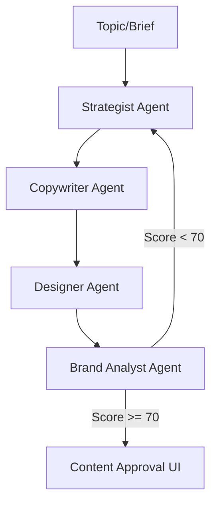

# Processos Internos e Infraestrutura de IA - Lifetrek Mirror

Este documento descreve os processos de automação, pipelines de IA e critérios de aceitação para o projeto Lifetrek.

## 1. Pipeline de Conteúdo (Multi-Agent)

O sistema utiliza uma arquitetura de múltiplos agentes para gerar posts de LinkedIn e Instagram:

### Agentes:
1.  **Strategist**: Define o arco narrativo (Hook -> Value -> CTA) baseado em RAG da Knowledge Base e pesquisa via Perplexity.
2.  **Copywriter**: Escreve o texto final seguindo o tom de voz da marca (técnico, parceiro, autoritário).
3.  **Designer**: Prioriza assets reais da Lifetrek via RAG em `product_catalog`. Se não houver, gera imagem via **Gemini 3 Pro Image (Nano Banana Pro)**.
4.  **Brand Analyst**: Faz o score final de qualidade e decide se precisa de regeneração.

## 2. Geração de Imagens (Nano Banana Pro)

Toda geração de imagem deve seguir estritamente o modelo `gemini-3-pro-image-preview`.

### Critérios de Aceitação (Hard Rules):
*   **Logo**: Usar o logo correto da Lifetrek ou nenhum logo. Nunca inventar um logo similar.
*   **Wording**: Zero erros ortográficos em textos dentro da imagem.
*   **Identidade**: Fotorealismo, iluminação de estúdio premium, foco em ambiente industrial limpo (cleanroom).
*   **Assets**: O sistema deve sempre tentar buscar uma foto real da equipe ou fábrica no banco de dados antes de gerar uma nova.

## 3. Fluxo de Aprovação e Deduplicação

A interface de Aprovação de Conteúdo foi desenhada para garantir que nenhum conteúdo "alucinado" vá para o ar.

### Checklist de Aprovação:
O botão de aprovação para Instagram é bloqueado até que os seguintes critérios sejam marcados manualmente pelo Admin:
- [ ] Logo correto ou ausente
- [ ] Identidade visual Lifetrek
- [ ] Sem erros de português/wording
- [ ] Contém assets reais (fotos/equipe)

### Deduplicação:
Existe um processo de limpeza que remove itens duplicados (mesmo título/tipo) tanto da UI quanto do banco de dados para manter o workspace limpo.

## 4. Scripts e Comandos Úteis

*   **`npm run dev`**: Inicia o ambiente de desenvolvimento local (Vite).
*   **`npm run dev:web`**: Atalho para subir o frontend.
*   **RAG Ingestion**: Scripts em `scripts/ingest_docs.js` e `ingest_assets.js` para atualizar o conhecimento da IA.
*   **`npx tsx scripts/validate_website_bot_rag.ts`**: Smoke check do roteamento híbrido da Julia (fato exato vs RAG vs fallback).

### 4.1 Website Bot (roteamento híbrido)

- Perguntas de inventário/fato exato devem ser atendidas via `company_facts`.
- Perguntas de capacidade/processo devem usar recuperação em `knowledge_base` + geração do modelo.
- Os logs do `website-bot` devem registrar `route_intent`, `route_branch` e `retrieval_mode` para auditoria rápida.

## 5. Configuração de Variáveis de Ambiente

Campos obrigatórios para o funcionamento pleno:
- `GEMINI_API_KEY`: Geração de imagens e conteúdo.
- `OPEN_ROUTER_API`: Modelos de texto (Gemini 2.0 Flash).
- `SUPABASE_URL` / `SUPABASE_SERVICE_ROLE_KEY`: Acesso ao banco e storage.
- `PERPLEXITY_API_KEY`: Pesquisa de mercado em tempo real.
- `UNIPILE_API_KEY`: Integração com LinkedIn Inbox.

---
*Ultima atualização: Fevereiro de 2026*
