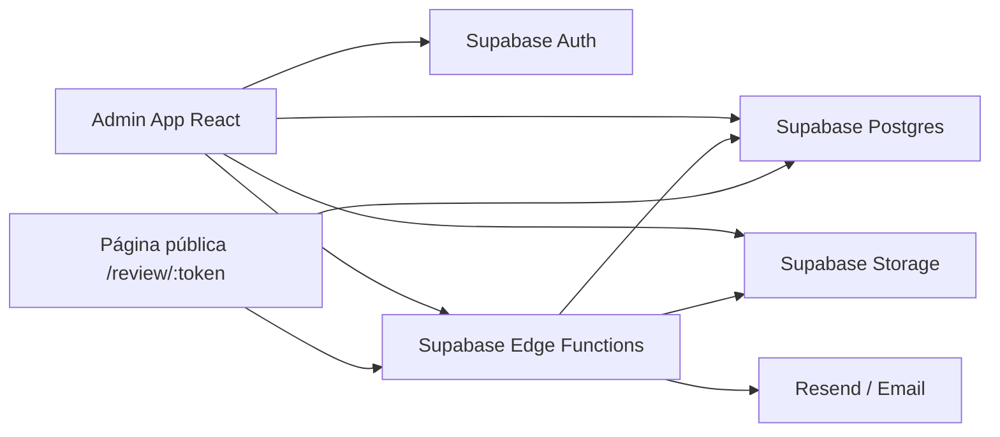
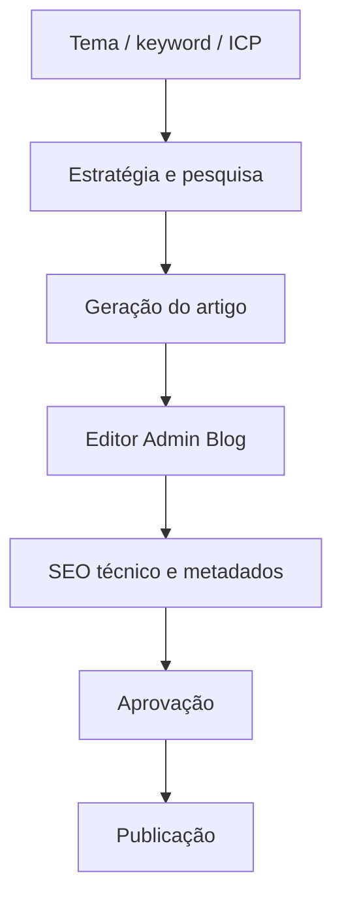
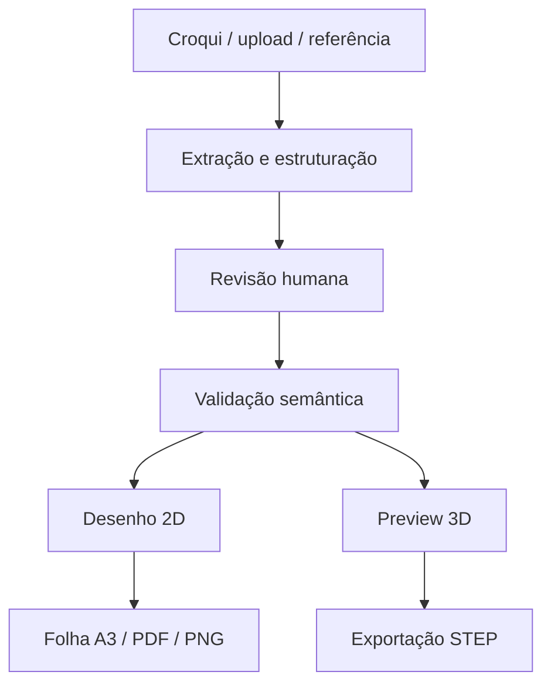

# BMAD Standard Documentation - Lifetrek

Data: 2026-04-23  
Idioma: Português do Brasil  
Público: equipe Lifetrek, representantes técnicos, marketing, operação comercial e engenharia

## 1. Visão Executiva

O Lifetrek é uma aplicação interna para apoiar o crescimento comercial técnico da Lifetrek Medical. O foco atual é transformar conhecimento técnico, conteúdo institucional, relacionamento com leads e aprovação de materiais em fluxos administráveis dentro de um painel único.

A versão atual deve ser entendida como uma plataforma de operação comercial e conteúdo técnico, não como um produto de edição avançada de imagem ou vídeo. A direção estratégica mudou: recursos de edição visual e vídeo deixam de ser prioridade de desenvolvimento, porque a tecnologia disponível e os resultados obtidos não entregaram consistência suficiente para uso como diferencial principal. O visual continua importante, mas como suporte ao conteúdo aprovado e à marca, usando templates e fotos reais da Lifetrek.

Os módulos mais importantes agora são:

- Sistema de aprovação por email para stakeholders.
- Gerador e editor de blog com SEO técnico.
- CRM de leads e pipeline comercial.
- Analytics unificado para website, LinkedIn, conteúdo e leads.
- Sistema de desenho técnico para peças, validação, visualização 2D/3D e exportação.
- Orquestrador de conteúdo para geração, revisão e publicação controlada.

## 2. Mudanças Desta Versão

### Removido do posicionamento principal

As documentações antigas davam peso excessivo a recursos de edição de imagem, edição visual manual e vídeo dentro do app. Esses recursos não devem mais ser apresentados como o centro do produto.

O que permanece:

- Geração de imagens para carrosséis e posts como apoio ao conteúdo.
- Uso de fotos reais da Lifetrek como base visual.
- Templates visuais aprovados para consistência de marca.
- Recursos técnicos existentes no código, quando úteis para manutenção.

O que não deve ser vendido internamente como prioridade:

- Editor avançado de imagem dentro do app.
- Editor de vídeo como fluxo estratégico.
- Promessa de criação visual 100% automática com qualidade final garantida.
- Novos estilos visuais fora dos templates aprovados.

### Adicionado como foco principal

O produto agora deve ser documentado em torno dos fluxos que geram valor operacional:

- Aprovação rápida por email com página pública segura por token.
- Blog técnico com geração assistida, edição, SEO e aprovação.
- CRM com funil, priorização, importação/exportação e visão de pipeline.
- Analytics para conteúdo, tráfego, LinkedIn, leads e relatório mensal.
- Desenho técnico com fluxo de croqui, validação, desenho 2D, 3D e STEP.

## 3. Escopo Atual do Produto

O Lifetrek atende cinco frentes principais.

### Conteúdo e aprovação

O sistema permite gerar ideias, rascunhos e peças de conteúdo, revisar materiais, aprovar internamente e enviar lotes para aprovação externa por email. O objetivo é reduzir dependência de conversas soltas e manter rastreabilidade de decisões.

### Blog e SEO técnico

O blog deve ser o canal de conteúdo técnico mais profundo da Lifetrek. O editor precisa apoiar artigos em português, com ICP claro, palavra-chave pilar, entidades técnicas, CTA controlado e fluxo de aprovação antes de publicação.

### CRM comercial

O CRM concentra leads, status comercial, prioridade, origem, empresa, contato e atividades básicas. A função principal é dar visibilidade ao pipeline e permitir ação rápida pelos representantes técnicos.

### Analytics

A área de analytics consolida indicadores de website, LinkedIn, conteúdo e leads. O objetivo é avaliar desempenho real, identificar temas que geram interesse e orientar o próximo ciclo de conteúdo e prospecção.

### Desenho técnico

O módulo de desenho técnico ajuda a transformar croquis, descrições ou referências em documentação técnica estruturada. Ele suporta revisão semântica, desenho 2D, folha A3, visualização 3D, validações e exportação STEP.

## 4. Arquitetura Técnica

### Stack principal

- Frontend: React 18, TypeScript, Vite e Tailwind CSS.
- Estado e dados: TanStack React Query, hooks dedicados e Supabase client.
- Backend: Supabase Auth, Postgres, Row Level Security, Storage e Edge Functions.
- Visualização técnica: Three.js, OpenCascade.js/WebAssembly e renderização SVG/Canvas.
- Gráficos: Recharts.
- Testes: Playwright para E2E e verificações visuais quando aplicável.

### Estrutura de alto nível

### Rotas administrativas principais

- `/admin/orchestrator`: geração e orquestração de conteúdo.
- `/admin/content-approval`: aprovação interna e envio para stakeholders.
- `/admin/blog`: gestão, edição, SEO e publicação de artigos.
- `/admin/leads`: CRM de leads.
- `/admin/analytics`: analytics unificado.
- `/admin/desenho-tecnico`: fluxo de desenho técnico.
- `/admin/social`: workspace social e suporte visual.
- `/review/:token`: página pública de aprovação por email.

### Princípios arquiteturais

- Autenticação administrativa obrigatória para operações internas.
- Tokens públicos apenas para aprovação externa, com escopo limitado e expiração.
- Edge Functions para ações sensíveis, integrações, geração e operações que exigem permissões server-side.
- RLS e validações de permissão para proteger tabelas administrativas.
- Separação entre rascunho, aprovação interna, aprovação de stakeholder e publicação.

## 5. Sistema de Aprovação por Email

O sistema de aprovação por email é uma das partes mais importantes da versão atual. Ele permite enviar um lote de conteúdos aprovados internamente para revisores externos ou stakeholders da Lifetrek.

### Fluxo operacional

1. O conteúdo é criado e passa por revisão interna.
2. Um administrador seleciona os posts no painel de aprovação.
3. O modal de envio mostra uma prévia do lote, revisores e assunto do email.
4. A Edge Function cria um lote de revisão, tokens e itens de revisão.
5. Cada stakeholder recebe um email com link seguro.
6. O stakeholder abre `/review/:token` sem precisar de login.
7. Ele pode aprovar, rejeitar ou sugerir edição de copy.
8. O sistema atualiza status e mantém registro de decisão.

### Componentes principais

- `src/components/admin/content/SendReviewModal.tsx`
- `supabase/functions/send-stakeholder-review/index.ts`
- `supabase/functions/stakeholder-review-action/index.ts`
- `supabase/functions/_shared/stakeholderReviewEmail.ts`
- `src/App.tsx` rota pública `/review/:token`

### Tabelas principais

- `stakeholder_review_batches`: lote enviado para revisão.
- `stakeholder_review_tokens`: token seguro por stakeholder.
- `stakeholder_review_items`: conteúdo individual dentro do lote.

### Estados relevantes

- `stakeholder_review_pending`
- `stakeholder_approved`
- `stakeholder_rejected`

### Regras de produto

- Apenas conteúdos já aprovados internamente devem ser enviados.
- Tokens precisam expirar.
- A página pública não deve expor dados administrativos desnecessários.
- Rejeição deve exigir comentário ou contexto suficiente para ação.
- Sugestões de edição devem ficar rastreáveis e associadas ao item revisado.

## 6. Blog Generator e Editor

O blog é uma prioridade estratégica. A documentação antiga tratava o blog como um gerador mais simples e parcialmente separado. A versão atual deve documentar o blog como um fluxo completo: estratégia, geração, edição, SEO, revisão, aprovação e publicação.

### Objetivo

Produzir artigos técnicos em português que ajudem representantes técnicos e clientes a entender:

- fabricação de implantes;
- capacidade produtiva Lifetrek;
- qualidade e rastreabilidade;
- desenho técnico e requisitos de manufatura;
- temas educacionais que apoiam venda consultiva.

### Fluxo esperado

### Capacidades existentes

- Geração via `supabase/functions/generate-blog-post`.
- Uso de OpenRouter para estratégia, pesquisa e redação.
- Suporte a RAG/contexto quando disponível.
- Geração de título, SEO title, SEO description, resumo, slug, keywords e tags.
- Editor administrativo em `/admin/blog`.
- Campos de ICP primário, palavra-chave pilar, entity keywords e modo de CTA.
- Aprovação e publicação com validação de metadados obrigatórios.
- Sincronização de imagem destacada e imagem hero quando aplicável.

### Regras editoriais recomendadas

- Conteúdo em português do Brasil.
- Tom técnico, direto e engenheiro-para-engenheiro.
- Evitar clichês de marketing.
- Priorizar clareza, precisão e aplicabilidade.
- Não mencionar clientes, automação comercial interna, IA ou CRM quando isso não for parte explícita do artigo.
- Cada artigo deve ter ICP primário e palavra-chave pilar antes de aprovação.

### Arquivos principais

- `src/pages/Admin/AdminBlog.tsx`
- `src/hooks/useBlogPosts.ts`
- `src/types/blog.ts`
- `supabase/functions/generate-blog-post/index.ts`
- `supabase/functions/generate-blog-images/index.ts`
- `supabase/migrations/20251230140000_create_blog_tables.sql`
- `supabase/migrations/20260305113000_content_engine_foundation.sql`

### Próximo padrão desejado

O blog generator/editor deve ser tratado como um produto interno de alta qualidade. A geração automática cria a primeira versão, mas o valor final vem da edição técnica, validação por especialista e consistência de SEO.

## 7. CRM de Leads

O CRM é o centro operacional para acompanhar oportunidades comerciais. Ele deve continuar simples, visível e orientado a ação.

### Funções principais

- Visualização de leads em colunas por status.
- Priorização por temperatura ou relevância.
- Busca por nome, email, empresa e observações.
- Atualização rápida de status, prioridade e campos comerciais.
- Exportação CSV.
- Importação CSV de leads.
- Atualização em tempo real via Supabase Realtime.

### Status comerciais

- `new`
- `contacted`
- `in_progress`
- `quoted`
- `closed`
- `rejected`

### Prioridades

- `low`
- `medium`
- `high`

### Componentes principais

- `src/pages/AdminLeads.tsx`
- `src/components/admin/LeadsCRMBoard.tsx`
- `src/components/admin/LeadsSpreadsheet.tsx`
- `supabase/functions/import-leads/index.ts`
- `supabase/functions/manage-leads-csv/index.ts`

### Direção de produto

O CRM deve apoiar representantes técnicos, não substituir relacionamento humano. A prioridade é dar clareza sobre quem precisa de contato, qual estágio cada lead está e quais fontes geram oportunidades reais.

## 8. Analytics

A área de analytics deve responder perguntas operacionais:

- Quais conteúdos performaram melhor?
- Quais temas geram tráfego e engajamento?
- Quais leads estão chegando?
- Quais canais merecem mais esforço?
- O que deve entrar no próximo ciclo editorial?

### Áreas da interface

- Website.
- Conteúdo LinkedIn.
- Leads.
- Relatório mensal.

### Dados e integrações

- Importação de métricas LinkedIn por CSV/XLS/XLSX.
- Ingestão de dados via Edge Function.
- Sincronização de analytics quando configurada.
- Resumos importados por período.
- Tabelas de top posts, tráfego e fontes.
- Indicadores de leads e comportamento.

### Componentes principais

- `src/pages/Admin/UnifiedAnalytics.tsx`
- `src/components/admin/analytics/LinkedInCsvUploadPanel.tsx`
- `src/components/admin/analytics/ImportedAnalyticsSummary.tsx`
- `src/hooks/useImportedLinkedInAnalytics.ts`
- `supabase/functions/ingest-linkedin-analytics/index.ts`
- `supabase/functions/sync-ga4-analytics/index.ts`
- `supabase/functions/sync-linkedin-analytics/index.ts`

### Riscos conhecidos

- Alguns agregados ainda podem ser calculados no cliente e devem migrar para queries agregadas ou views quando o volume crescer.
- Linhas rejeitadas em importações devem ser fáceis de auditar.
- Os relatórios precisam conectar métricas a decisões editoriais e comerciais, não apenas mostrar números.

## 9. Desenho Técnico

O módulo de desenho técnico é uma frente estratégica porque conecta engenharia, manufatura e venda técnica. Ele deve ajudar a transformar uma solicitação ou referência em documentação técnica verificável.

### Objetivo

Permitir que a equipe avance de uma ideia, croqui ou peça de referência para:

- documento técnico normalizado;
- desenho 2D;
- folha A3;
- validação dimensional e semântica;
- preview 3D;
- exportação STEP.

### Fluxo funcional

### Capacidades existentes

- Rota administrativa `/admin/desenho-tecnico`.
- Upload/referência de entrada.
- Documento técnico normalizado.
- Geração de SVG técnico.
- Renderização A3.
- Exportação PDF/PNG.
- Visualização 3D.
- Exportação STEP com OpenCascade.js.
- Persistência de sessões.
- Bloqueios de revisão antes de exportações sensíveis.

### Arquivos principais

- `src/components/admin/engineering/TechnicalDrawingCore.tsx`
- `src/components/admin/engineering/EngineeringDrawing3DPreview.tsx`
- `src/lib/engineering-drawing/renderStep.ts`
- `src/lib/engineering-drawing/svg-renderer.ts`
- `src/lib/engineering-drawing/renderA3.ts`
- `src/lib/engineering-drawing/validation.ts`
- `src/lib/engineering-drawing/semantic-validation.ts`
- `src/lib/engineering-drawing/repository.ts`
- `supabase/functions/engineering-drawing/index.ts`
- `supabase/migrations/20260402161000_create_engineering_drawing_sessions.sql`
- `supabase/migrations/20260407193000_add_engineering_drawing_normalized_document.sql`

### Regras de produto

- O desenho técnico não deve pular revisão humana quando houver ambiguidade.
- Exportações técnicas devem depender de validação mínima.
- O sistema deve explicar pendências em linguagem clara.
- A interface deve priorizar fluxo técnico, não efeitos visuais.
- O arquivo STEP deve ser tratado como artefato técnico, não apenas visualização.

### Melhorias pendentes

- Polir stepper do fluxo principal.
- Melhorar hierarquia do botão de exportação STEP.
- Reduzir sobreposição de textos no desenho 2D.
- Melhorar UX de ambiguidade e revisão semântica.

## 10. Orquestrador de Conteúdo e Social Workspace

O orquestrador continua relevante, mas seu papel deve ser descrito corretamente: ele apoia a criação, revisão e organização de conteúdo. Ele não é mais o centro de uma estratégia de edição avançada de imagem ou vídeo.

### Funções atuais

- Gerar e organizar ideias de conteúdo.
- Criar rascunhos para canais sociais.
- Preparar carrosséis e materiais de apoio.
- Usar templates visuais aprovados.
- Manter conteúdo alinhado à marca.
- Integrar com aprovação interna e stakeholder review.

### Regra visual

Toda imagem final deve seguir os templates aprovados e usar fotos reais da Lifetrek sempre que possível. IA visual pode apoiar experimentos, mas não deve substituir a consistência de marca nem virar promessa central do produto.

### Templates aprovados

- Glassmorphism Card.
- Full-Bleed Dark Text.
- Split Comparison.
- Pure Photo / Equipment Showcase.

## 11. Dados Principais

### Conteúdo

- Posts sociais e itens de conteúdo.
- Slides e variantes de imagem.
- Status de aprovação interna e stakeholder.
- Metadados de canal, legenda, visual e programação.

### Blog

- `blog_posts`
- `blog_categories`
- Metadados de SEO, ICP, CTA, keywords e imagens.

### Stakeholder review

- `stakeholder_review_batches`
- `stakeholder_review_tokens`
- `stakeholder_review_items`

### CRM

- `contact_leads`
- Campos de status, prioridade, empresa, origem, score e notas.

### Analytics

- `linkedin_analytics`
- Eventos e agregados internos.
- Dados de website e relatórios mensais quando configurados.

### Desenho técnico

- Sessões de desenho técnico.
- Documento normalizado.
- Artefatos exportados em Storage.

## 12. Edge Functions e Contratos Ativos

### Aprovação

- `send-stakeholder-review`: cria lote, tokens e envia email.
- `stakeholder-review-action`: busca lote público, aprova, rejeita ou registra sugestão.

### Blog

- `generate-blog-post`: gera artigo técnico com estratégia, SEO e conteúdo.
- `generate-blog-images`: gera ou associa imagens ao blog quando necessário.

### Analytics

- `ingest-linkedin-analytics`: valida/importa métricas do LinkedIn.
- `sync-ga4-analytics`: sincroniza dados de Google Analytics quando configurado.
- `sync-linkedin-analytics`: sincroniza dados LinkedIn quando configurado.

### CRM

- `import-leads`: importação administrativa de leads.
- `manage-leads-csv`: operações legadas/auxiliares de CSV.

### Desenho técnico

- `engineering-drawing`: processamento server-side do fluxo técnico.

### Visual de apoio

- `regenerate-carousel-images`: gera novas versões de imagens de carrossel.
- `set-slide-background`: define imagem de fundo para um slide.

Essas funções visuais são suporte ao conteúdo. Elas não definem o posicionamento principal do produto.

## 13. Segurança e Operação

### Credenciais e segredos

Nunca expor ou commitar:

- `SUPABASE_SERVICE_ROLE_KEY`
- `UNIPILE_DSN`
- `UNIPILE_API_KEY`
- `LOVABLE_API_KEY`
- `OPENROUTER_API_KEY`

### LinkedIn e automação

- Não executar automação de outreach sem aprovação explícita.
- Não usar scripts depreciados de Unipile.
- Preferir sempre a Admin UI para operações relacionadas a LinkedIn.

### Imagens e versionamento

- Nunca sobrescrever imagens existentes de carrossel.
- Sempre criar nova variante com timestamp/filename novo.
- Manter histórico para comparação.

### Aprovação e publicação

- Conteúdo deve passar por aprovação antes de publicação.
- Blog precisa de metadados mínimos antes de aprovação/publicação.
- Revisões externas devem ficar registradas por lote, item e reviewer.

## 14. Status Atual e Lacunas

### Forte o suficiente para uso interno

- Aprovação por email com página pública por token.
- Blog admin com campos editoriais e SEO.
- CRM de leads.
- Analytics com importação LinkedIn e visões agregadas.
- Desenho técnico end-to-end com 2D, 3D e STEP.

### Precisa continuar evoluindo

- Qualidade editorial e UX do blog generator/editor.
- Agregações de analytics em backend para maior escala.
- Melhor auditoria de erros de importação.
- UX final do desenho técnico.
- Integração entre analytics, CRM e decisões de conteúdo.

### Fora do foco principal

- Editor avançado de imagem.
- Editor de vídeo.
- Geração visual como promessa isolada de produto.

## 15. Como Usar Esta Documentação

Esta documentação deve ser usada como referência padrão da equipe Lifetrek para explicar o estado atual do produto, alinhar prioridades e orientar próximos desenvolvimentos.

### Documentos por setor

Para aprofundamento por área, usar:

- [Aprovação e Publicação](./sectors/approval-and-publishing.md)
- [Blog e Editorial](./sectors/blog-and-editorial.md)
- [CRM e Leads](./sectors/crm-and-leads.md)
- [Analytics e Relatórios](./sectors/analytics-and-reporting.md)
- [Desenho Técnico](./sectors/technical-drawing.md)
- [Suporte Social e Governança Visual](./sectors/social-content-support.md)

Quando for compartilhada no Drive, recomenda-se:

- Nome do arquivo: `BMAD Standard Documentation - Lifetrek PT-BR`.
- Permissão: leitura para a equipe ampla; edição apenas para responsáveis de produto/tecnologia.
- Atualização: revisar após cada entrega relevante de sprint.
- Fonte técnica: manter este Markdown no repositório como versão controlada.

## 16. Próximos Passos Recomendados

1. Transformar este Markdown em Google Doc compartilhável.
2. Revisar com equipe comercial e engenharia para validar linguagem e prioridade.
3. Atualizar prints/screenshots depois da próxima validação visual do app.
4. Criar uma versão curta executiva para onboarding interno.
5. Manter documentos especializados separados para blog, analytics, CRM e desenho técnico.
