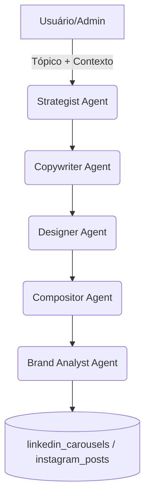

# Guia do Content Engine (LinkedIn & Instagram)

Este documento descreve o estado atual do pipeline de conteúdo e a nova lógica de seleção inteligente de fundo (asset real vs IA), além do fluxo de override manual no UI.

## Arquitetura do Pipeline

Resumo por agente:
- `strategistAgent`: define narrativa e estrutura de slides.
- `copywriterAgent`: gera headline e corpo.
- `designerAgent`: decide imagem de fundo (real vs IA).
- `compositorAgent`: aplica layout padrão Lifetrek (overlay, card, tipografia).
- `brandAnalystAgent`: valida qualidade e status final (`draft`/`pending_approval`).

## Playbook técnico (AI/LLM Search)

Para tópicos de infraestrutura de IA (LLM ranking, prefill-only, latência, throughput, serving), o pipeline agora injeta automaticamente um playbook baseado no case da engenharia do LinkedIn sobre SGLang (20/02/2026):

- ativa no `strategistAgent` e `strategistPlansAgent` para organizar a narrativa em estágios de otimização;
- ativa no `copywriterAgent` para reforçar tom técnico e uso responsável de métricas;
- mantém guardrail de atribuição de benchmarks (dados reportados pela fonte, não pela Lifetrek).

## Decisão Inteligente de Fundo (`mode: "smart"`)

Implementado em `regenerate-carousel-images` para priorizar imagem real e usar IA somente quando necessário.

### 1) Classificação de intenção por slide

Classes:
- `company_trust`
- `quality_machines_metrology`
- `cleanroom_iso`
- `vet_odonto_product`
- `generic`

### 2) Pool preferencial por intenção

- `company_trust`: facility (exterior, reception, production-overview, office).
- `quality_machines_metrology`: equipment + facility de chão de fábrica/metrologia.
- `cleanroom_iso`: clean-room-* + cleanroom-hero.
- `vet_odonto_product`: product assets.
- `generic`: todos elegíveis.

### 3) Score e thresholds

Fórmula:
- `score_final = cosine_similarity + keyword_boost + curated_boost`
- Cap: `0.99`
- `keyword_boost` inclui sinal lexical + alinhamento de pool por intenção (para funcionar mesmo quando embedding estiver indisponível).

Thresholds default:
- `company_trust`: `0.68`
- `quality_machines_metrology`: `0.66`
- `cleanroom_iso`: `0.64`
- `vet_odonto_product`: `0.62`
- `generic`: `0.70`

Regra:
- se `score_final < threshold` e `allow_ai_fallback = true`, gera fundo com IA apenas para aquele slide.

Observação operacional:
- quando a geração de embedding falha (ex.: chave externa indisponível), o seletor continua operacional por scoring lexical/curated e ainda prioriza assets reais.

### 4) Anti-repetição

- evita repetir o mesmo fundo em slides consecutivos.
- se o melhor candidato foi usado recentemente e há alternativa com diferença de score <= `0.03`, usa a alternativa.

### 5) Curated overrides (hard rules)

- `parceiro/solução completa` -> prioriza `exterior/reception/production-overview`.
- `qualidade/máquinas/metrologia/ZEISS/CMM` -> prioriza metrologia/equipment.
- `sala limpa/ISO 7/ANVISA/FDA` -> prioriza clean-room assets.
- `vet/odonto` sem candidato forte -> product assets; sem product forte -> IA.

## Edição Manual no UI (Design Tab)

Tela:
- `/admin/social?tab=design`

Fluxo:
1. clicar `Trocar Fundo`.
2. usar aba `Sugestões` (rank por score/motivo) ou `Biblioteca` (filtros por categoria).
3. clicar `Aplicar`.
4. opcional: `Gerar com IA`.
5. consultar `Ver versões`.

Persistência:
- atualização do slide atual (`image_url` / `imageUrl`).
- append em `image_variants` (histórico preservado).
- atualização de `image_urls[slide_index]`.
- metadados: `asset_source`, `selection_score`, `selection_reason`, `asset_id`.

## APIs e Dados Novos

- Edge function `regenerate-carousel-images`:
  - `mode: "smart" | "hybrid" | "ai"`
  - `allow_ai_fallback: boolean`
  - saída por slide: `asset_source`, `selection_score`, `selection_reason`.
  - auth: validação manual de bearer token + permissão admin dentro da function.
- Edge function `set-slide-background`:
  - override manual de 1 slide com histórico.
  - auth: validação manual de bearer token + permissão admin dentro da function.
- Tabela `asset_embeddings` + RPC `match_asset_candidates(...)`:
  - índice vetorial para busca semântica de assets.

## Exemplo aplicado: "Um Parceiro. Solução Completa."

Recomendação padrão:
- slide 0: exterior/reception
- slide 1: production-floor/water-treatment
- slide 2: production-overview/machine context
- slide final CTA: cleanroom-hero ou exterior institucional

Validação real (2026-03-05):
- Post: `instagram_posts.id = a31da9e2-367c-4c22-ba81-af7831d25976`
- Slide 0 regenerado em `mode=smart` com `asset_source=rule_override`, `selection_score=0.81`
- Asset escolhido: `clean-room-exterior.jpg`
- Em seguida, override manual via `Trocar Fundo` para `reception.webp`, com histórico preservado em `image_variants`

## Referências

- Decision tree (FigJam): `https://www.figma.com/online-whiteboard/create-diagram/da6acd52-9110-4a34-bc3b-0da23ad8cccd`
- Arquitetura atual vs futura (FigJam): `https://www.figma.com/online-whiteboard/create-diagram/28be3680-b190-4c49-be27-0378f8e27656`

## Arquivos-chave de implementação

- `supabase/functions/regenerate-carousel-images/index.ts`
- `supabase/functions/regenerate-carousel-images/handlers/smart.ts`
- `supabase/functions/regenerate-carousel-images/utils/assets.ts`
- `supabase/functions/set-slide-background/index.ts`
- `src/components/admin/content/ImageEditorCore.tsx`
- `src/components/admin/content/ContentApprovalCore.tsx`
