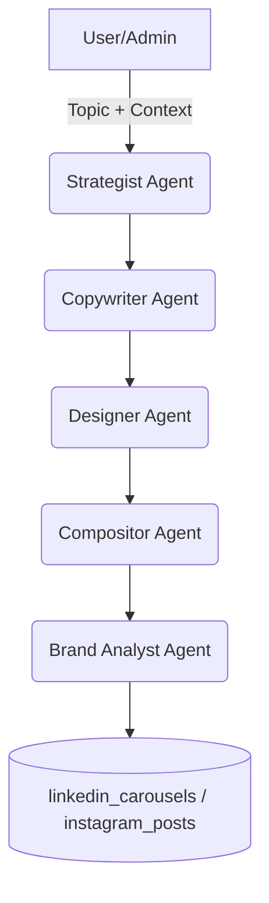

# Content Engine Guide (LinkedIn & Instagram)

This document describes the content pipeline, smart background selection logic (real asset vs AI), and the manual visual override flow in the UI.

**Scope note (2026-04-23):** this guide covers visual support for social content. It should not be used to position Lifetrek as an advanced in-app image or video editor. The current product priority is email approval, technical blogging, CRM, analytics, and technical drawing; visuals remain a brand/content support layer.

## Pipeline Architecture

Agent summary:

- `strategistAgent`: defines slide narrative and structure.
- `copywriterAgent`: generates headline and body copy.
- `designerAgent`: chooses background direction (real vs AI).
- `compositorAgent`: applies the standard Lifetrek layout (overlay, card, typography).
- `brandAnalystAgent`: validates quality and final content status (`draft` / `pending_approval`).

## Technical Playbook (AI/LLM Search)

For AI infrastructure topics (LLM ranking, prefill-only, latency, throughput, serving), the pipeline now injects a playbook based on LinkedIn Engineering's SGLang case study (2026-02-20):

- active in `strategistAgent` and `strategistPlansAgent` for stage-based narrative organization;
- active in `copywriterAgent` to reinforce technical tone and responsible use of metrics;
- preserves attribution guardrails for externally reported benchmarks.

## Smart Background Decision (`mode: "smart"`)

Implemented in `regenerate-carousel-images` to prioritize real images and use AI only when necessary.

### 1) Slide Intent Classification

Classes:

- `company_trust`
- `quality_machines_metrology`
- `cleanroom_iso`
- `vet_odonto_product`
- `generic`

### 2) Preferred Pool by Intent

- `company_trust`: facility (exterior, reception, production-overview, office)
- `quality_machines_metrology`: equipment + production/metrology facility assets
- `cleanroom_iso`: clean-room-* + cleanroom-hero
- `vet_odonto_product`: product assets
- `generic`: all eligible assets

### 3) Score and Thresholds

Formula:

- `score_final = cosine_similarity + keyword_boost + curated_boost`
- cap: `0.99`
- `keyword_boost` includes lexical signals and intent-pool alignment so the selector still works when embeddings are unavailable

Default thresholds:

- `company_trust`: `0.68`
- `quality_machines_metrology`: `0.66`
- `cleanroom_iso`: `0.64`
- `vet_odonto_product`: `0.62`
- `generic`: `0.70`

Rule:

- if `score_final < threshold` and `allow_ai_fallback = true`, AI is used only for that specific slide

Operational note:

- when embedding generation fails (for example due to missing external credentials), the selector continues operating through lexical/curated scoring and still prioritizes real assets

### 4) Anti-Repetition

- avoids repeating the same background in consecutive slides
- if the best candidate was used recently and another candidate is within `0.03` score difference, the alternative is used

### 5) Curated Overrides (Hard Rules)

- `parceiro/solução completa` -> prioritize `exterior/reception/production-overview`
- `qualidade/máquinas/metrologia/ZEISS/CMM` -> prioritize metrology/equipment
- `sala limpa/ISO 7/ANVISA/FDA` -> prioritize clean-room assets
- `vet/odonto` without a strong candidate -> use product assets; if no strong product match exists -> use AI

## Visual Support in the UI (Design Tab)

Screen:

- `/admin/social?tab=design`

Flow:

1. click `Trocar Fundo`
2. use `Sugestões` (ranked by score/reason) or `Biblioteca` (category filters)
3. click `Aplicar`
4. optionally use `Gerar com IA` only when no real asset is good enough
5. review `Ver versões`

Persistence:

- updates the active slide (`image_url` / `imageUrl`)
- appends into `image_variants` (history preserved)
- updates `image_urls[slide_index]`
- saves metadata: `asset_source`, `selection_score`, `selection_reason`, `asset_id`

## New APIs and Data

- Edge function `regenerate-carousel-images`:
  - `mode: "smart" | "hybrid" | "ai"`
  - `allow_ai_fallback: boolean`
  - per-slide output: `asset_source`, `selection_score`, `selection_reason`
  - auth: manual bearer token validation + admin permission inside the function

- Edge function `set-slide-background`:
  - single-slide manual override with history
  - auth: manual bearer token validation + admin permission inside the function

- Table `asset_embeddings` + RPC `match_asset_candidates(...)`:
  - vector index for semantic asset search

## Applied Example: "Um Parceiro. Solução Completa."

Default recommendation:

- slide 0: exterior/reception
- slide 1: production-floor/water-treatment
- slide 2: production-overview/machine context
- final CTA slide: cleanroom-hero or institutional exterior

Observed validation (2026-03-05):

- Post: `instagram_posts.id = a31da9e2-367c-4c22-ba81-af7831d25976`
- Slide 0 regenerated in `mode=smart` with `asset_source=rule_override`, `selection_score=0.81`
- Chosen asset: `clean-room-exterior.jpg`
- Then manually overridden through `Trocar Fundo` to `reception.webp`, preserving history in `image_variants`

## References

- Decision tree (FigJam): `https://www.figma.com/online-whiteboard/create-diagram/da6acd52-9110-4a34-bc3b-0da23ad8cccd`
- Current vs future architecture (FigJam): `https://www.figma.com/online-whiteboard/create-diagram/28be3680-b190-4c49-be27-0378f8e27656`

## Key Implementation Files

- `supabase/functions/regenerate-carousel-images/index.ts`
- `supabase/functions/regenerate-carousel-images/handlers/smart.ts`
- `supabase/functions/regenerate-carousel-images/utils/assets.ts`
- `supabase/functions/set-slide-background/index.ts`
- `src/components/admin/content/ImageEditorCore.tsx`
- `src/components/admin/content/ContentApprovalCore.tsx`
