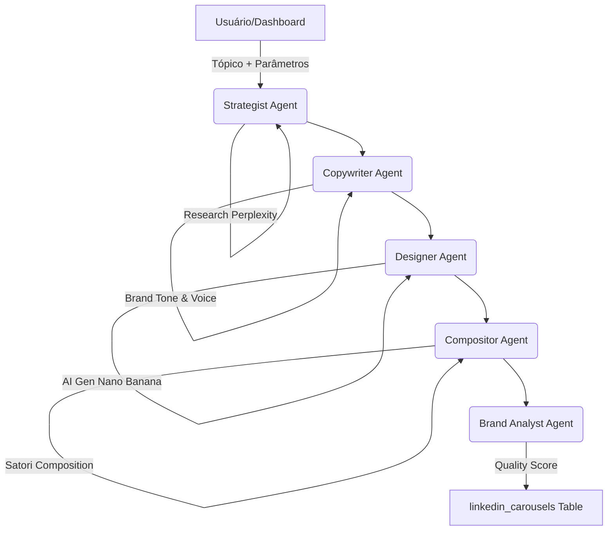

# Guia do Content Engine (LinkedIn & Instagram)

O Content Engine do Lifetrek é um sistema multi-agente projetado para transformar tópicos complexos de manufatura médica em conteúdo de alta qualidade para redes sociais, garantindo alinhamento de marca e rigor técnico.

## 🏗️ Arquitetura do Pipeline

O processo de geração segue um fluxo linear de refinação entre agentes especializados:

### 1. Strategist Agent (`strategistAgent`)

* **Função**: Define o ângulo narrativo, gancho (hook) e estrutura dos slides (geralmente 5-7 slides).
* **Contexto**: Utiliza pesquisa em tempo real (Perplexity) e busca vetorial na base de conhecimento interna para garantir que o conteúdo seja factualmente correto e atualizado.

### 2. Copywriter Agent (`copywriterAgent`)

* **Função**: Redige as manchetes e o corpo do texto de cada slide.
* **Tom de Voz**: Profissional, assertivo, tecnicamente preciso e focado em parceria. Utiliza o **Inter** como fonte padrão.

### 3. Designer Agent (`designerAgent`)

* **Função**: Recupera ou gera ativos visuais para os slides.
* **Prioridade**:
    1. **Ativos Reais**: Busca fotos reais da fábrica, equipamentos (Zeiss, CMM, Cincom) e produtos no `product_catalog`.
    2. **Geração AI**: Caso não encontre um match real satisfatório, gera uma imagem usando o modelo `Nano Banana Pro` (Gemini 3.0 Pro Image-Gen).

### 4. Compositor Agent (`compositorAgent`)

* **Função**: Atua como a "camada de acabamento" visual.
* **Tecnologia**: Usa **Satori** para sobrepor elementos de marca (Logo Lifetrek, cards de glassmorphism) sobre her backgrounds.
* **Resultado**: Imagens consistentes que parecem diagramadas por um designer humano, não apenas saídas brutas de uma IA.

### 5. Brand Analyst Agent (`brandAnalystAgent`)

* **Função**: Avalia a qualidade final e o alinhamento com o brand book.
* **Métrica**: Atribui um `quality_score`. Se a nota for >= 70, o conteúdo é marcado como `pending_approval`; caso contrário, fica como `draft` para refinamento manual.

---

## 🎨 Identidade Visual e Branding

O sistema utiliza tokens de design rígidos baseados no Brand Book:

* **Cores Corporativas**:
  * Blue Corporate: `#004F8F` (Confiança/Autoridade)
  * Innovation Green: `#1A7A3E` (Sucesso/Engenharia)
  * Energy Orange: `#F07818` (Destaques/CTA)
* **Estética Visual**: Glassmorphism (transparência com blur), minimalismo moderno, foco em engenharia e salas limpas.
* **Certificações**: O sistema insere automaticamente selos ISO 13485 em slides estratégicos para aumentar a autoridade.

---

## 💾 Gestão de Ativos e Dados

### Pesquisa Vetorial (RAG)

O Content Engine depende de dois índices principais no Supabase:

1. **Knowledge Base (`match_knowledge_base`)**: 768 dimensões. Armazena fatos técnicos, FAQs e regras de design.
2. **Product Catalog (`match_product_assets`)**: 1536 dimensões. Armazena fotos de máquinas (CNC), laboratórios e produtos reais.

### Versionamento e Melhoria Contínua

* **`image_variants`**: Cada slide mantém um histórico de imagens geradas. O usuário pode regenerar slides individualmente, e o sistema aprende qual variante foi aprovada para melhorar prompts futuros.
* **Metadados**: O sistema salva o `generation_metadata`, permitindo auditar qual prompt e qual modelo (Flash vs Pro) gerou cada post.

---

## 🚀 Como Melhorar o Output

1. **Alimentar o Product Catalog**: Quanto mais fotos reais de alta qualidade estiverem catalogadas com descrições técnicas, menos o sistema dependerá de imagens geradas por IA.
2. **Ajustar Styles**: Modificar a tabela `style_embeddings` permite mudar a "vibe" das gerações de IA sem mexer no código das Edge Functions.
3. **Refinar Prompt Templates**: Os templates principais residem em `supabase/functions/regenerate-carousel-images/prompts/brand-prompt.ts`.
