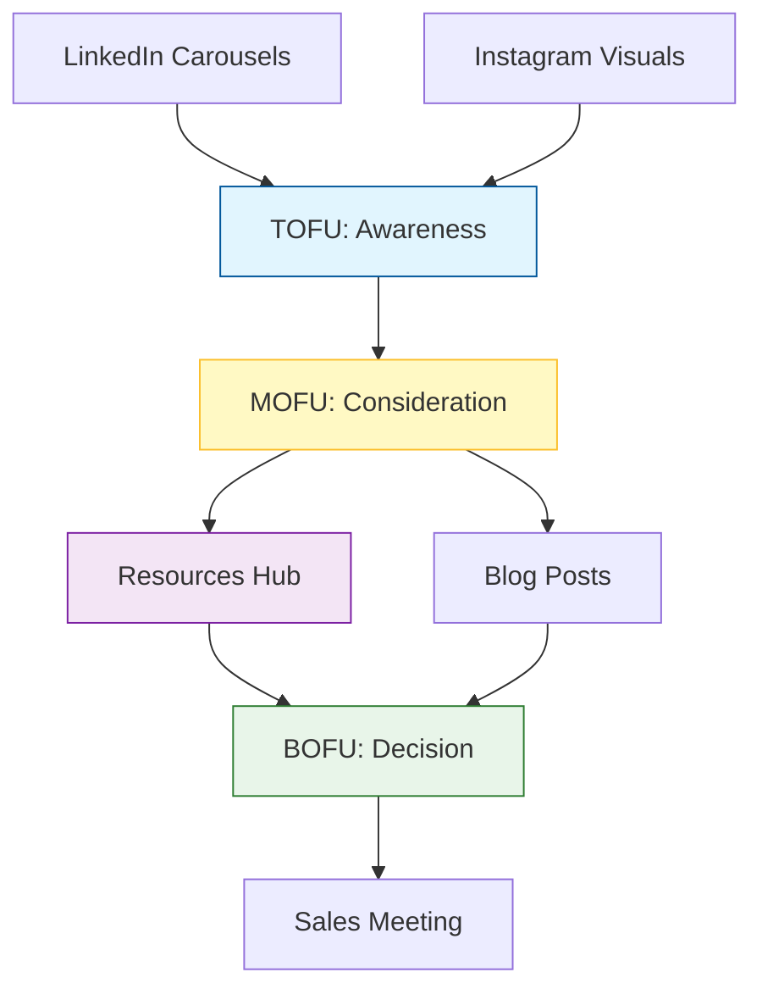

# Lifetrek Intentional Content Strategy

## The Marketing Funnel

We are shifting from generic content generation to an **Intentional Funnel Strategy**. Every piece of content serves a specific purpose in the user journey.

## Content-to-Resource Mapping logic

We will programmatically generate social content that specifically targets our existing resources.

| Funnel Stage | Content Topic (Example) | Associated Resource | Call to Action (CTA) |
| :--- | :--- | :--- | :--- |
| **Awareness** | "Top 5 Risks in Supply Chain 2026" | *Scorecard de Risco de Supply Chain* | "Assess your risk: Comment 'RISK' for the Scorecard" |
| **Consideration** | "How detailed should your DFM be?" | *Checklist DFM para Implantes* | "Download the full DFM Checklist (Link in Bio)" |
| **Decision** | "Migrating SKUs without stopping production" | *Roadmap de 90 Dias* | "Ready to start? DM us for the Roadmap" |

## Strategy Execution

The `generate_resource_campaign.ts` script will:
1.  **Fetch** all published resources from the database.
2.  **Generate** a LinkedIn Carousel topic derived *specifically* from that resource's title and content.
3.  **Assign** the correct CTA pointing to that resource.
4.  **Create** high-value content that bridges the gap between the problem (social post) and the solution (the resource).
