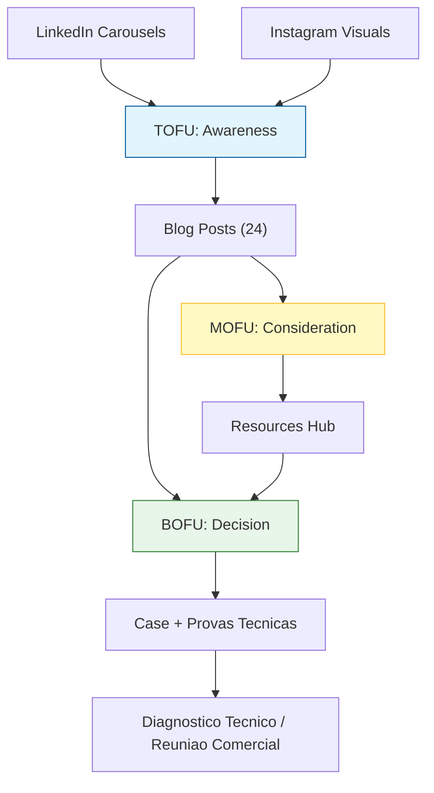

# Lifetrek Intentional Content Strategy

## Escopo e regra inegociavel

Este funil e exclusivamente sobre **Lifetrek Medical**.

- Nao usar nomes de outros clientes/consultorias (ex: ASC, Amorim Stout Consulting).
- Nao usar exemplos que desviem da proposta de valor da Lifetrek.
- Todo conteudo deve reforcar: manufatura de precisao, qualidade, metrologia, compliance quando relevante e reducao de risco na cadeia.
- Regra regulatoria obrigatoria (ANVISA): para materiais de "migracao para producao local", o ICP elegivel e empresa com atividade fabril no Brasil (propria ou etapa controlada). Distribuidores/importadores sem fabrica local nao sao ICP.

## Marketing Funnel (com blogs como pilar central)

Cada conteudo precisa ter papel claro no caminho ate reuniao comercial.

Para distribuição recorrente no LinkedIn, usar o sistema documentado em [Lifetrek LinkedIn Newsletter System](./strategy/lifetrek-linkedin-newsletter-system.md): blog/recurso como fonte canônica, newsletter como adaptação editorial e feed como peça curta de distribuição.

## Distribuicao dos 24 blogs (ate 31/05/2026)

Para evitar saturacao regulatoria, o mix editorial deve ser:

- 8 posts: engenharia de manufatura e processo
- 6 posts: qualidade e metrologia
- 4 posts: supply chain, risco e mercado
- 4 posts: regulatorio (ANVISA/ISO, apenas quando tema pedir)
- 2 posts: prova social / casos / capacidades Lifetrek

Regra de sequencia:

- **Maximo 2 posts regulatorios seguidos**.
- Sempre alternar com processo, qualidade, metrologia ou supply chain.

## ICP-First (Quem Atendemos)

Cada blog deve declarar ICP primario e ICP secundario no metadata:

- `MI`: Fabricantes de Implantes e Instrumentos Cirurgicos
- `OD`: Empresas de Equipamentos Odontologicos
- `VT`: Empresas Veterinarias
- `HS`: Instituicoes de Saude
- `CM`: Parceiros de Manufatura Contratada / OEM

Campos obrigatorios no `metadata` de `blog_posts`:

- `icp_primary`
- `icp_secondary`
- `icp_specificity_scores` (MI/OD/VT/HS/CM)
- `cta_mode` (`article_only`, `diagnostico`, `resource_optional`)
- `pillar_keyword`
- `entity_keywords`

Regra de publicacao:

- Bloquear publicacao sem `icp_primary` e `pillar_keyword`.

## Mapeamento por etapa do funil

| Funnel Stage | Conteudo | Objetivo | CTA |
| :--- | :--- | :--- | :--- |
| **TOFU** | Carrossel LinkedIn + blog tecnico introdutorio | Gerar descoberta e interesse tecnico | "Acesse o artigo completo" |
| **MOFU** | Blog tecnico aprofundado | Educar e qualificar lead | "Aprofundar criterios tecnicos com a Lifetrek" |
| **BOFU** | Blog de decisao (risco, ROI, validacao, transicao de fornecedor) | Reduzir risco percebido e acelerar decisao | "Agendar diagnostico tecnico com a Lifetrek" |

## Politica de lead magnet

- Regra padrao: o proprio blog e o lead magnet.
- Material complementar (checklist/guia) e opcional, apenas quando houver ganho claro de conversao.
- Priorizar `resource_optional` em temas BOFU de alta friccao tecnica.

## Regras de qualidade editorial dos blogs

- Linguagem tecnica, objetiva, sem hype.
- Conteudo orientado a problema real de OEM/engenharia/qualidade.
- Abertura do artigo com dor real do ICP primario.
- Encerramento com CTA tecnico de decisao (nao CTA generico de marketing).
- Nao forcar ANVISA em temas que nao sao regulatorios.
- Quando citar ANVISA em tema de producao local, incluir disclaimer de elegibilidade (excluir distribuidores/escritorio comercial sem etapa fabril local).
- Incluir secoes de referencia com fontes validas.
- Nunca citar clientes externos nao aprovados.

## Regras SEO/AIO por blog

- `seo_title` entre 40 e 65 caracteres.
- `seo_description` entre 140 e 160 caracteres.
- 3+ keywords relevantes.
- Capa horizontal em `featured_image`.
- 4+ fontes em `metadata.sources`.
- Secao `Referencias` no conteudo.
- FAQ (3+ perguntas) quando aplicavel.

## Execucao operacional

O fluxo de execucao deve:

1. Gerar tema e angulo com intencao de funil (TOFU/MOFU/BOFU).
2. Produzir rascunho tecnico com foco em Lifetrek.
3. Validar SEO/AIO + fontes.
4. Submeter para aprovacao interna (stakeholders).
5. Publicar/agendar conforme calendario ate 31/05/2026.
