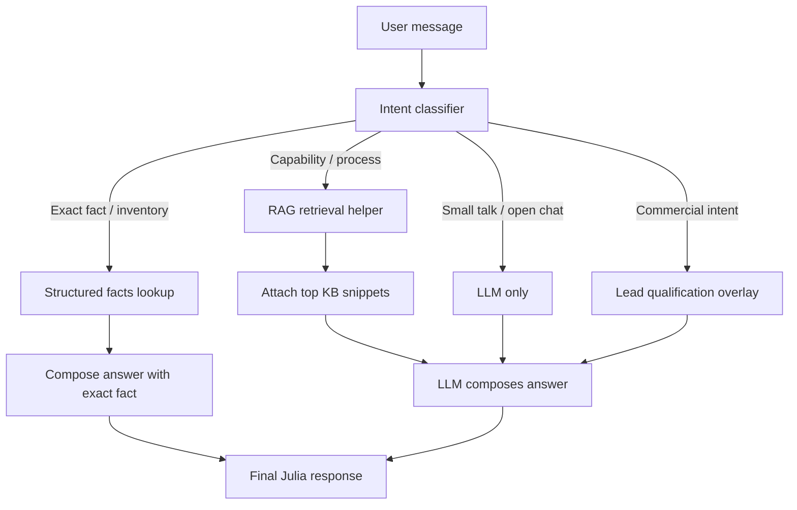

# fix: Julia hybrid RAG routing

## Overview

The website chatbot should not behave like a pure rules engine or a pure chat model. Exact company facts such as equipment availability and inventory counts should resolve through structured lookup first, while open-ended capability questions should retrieve supporting context from Supabase and still flow through the LLM for a natural answer. This plan keeps the current `website-bot` entry point, adds a structured facts source for inventory-style claims, and formalizes retrieval as a tool-like step instead of prompt stuffing.

## Problem Frame

The current chatbot can still answer against the wrong branch of logic: a direct question like “Vocês têm Citizen L20?” may get a contradiction even when the company knowledge contains the opposite fact. The user wants the assistant to stay probabilistic for open questions, but deterministic for exact company facts, with RAG working as a retrieval step that the LLM can use before composing the final response.

The technical gap is that the bot currently mixes lead qualification, retrieval, and final generation inside one edge function without a clear separation between:

- exact fact lookup for structured company truths,
- narrative retrieval for capability explanations,
- final language generation by the model.

## Requirements Trace

- R1. Exact availability and inventory questions must return the correct company fact instead of model guesswork.
- R2. Capability and process questions must still reach the LLM after retrieval so the answer can stay conversational and contextual.
- R3. The retrieval step must be observable so we can tell whether the bot used exact lookup, vector/text retrieval, or pure model generation.
- R4. The current lead qualification and WhatsApp handoff behavior must remain available, but it should not override factual answers.
- R5. The chatbot must keep using company-owned knowledge stored in Supabase as the source of truth.

## Scope Boundaries

- Do not redesign the public chat UI.
- Do not change unrelated content generation flows.
- Do not replace Supabase as the knowledge store.
- Do not try to make every answer deterministic; only exact facts and inventory-style questions should short-circuit.
- Do not add a separate agent framework unless it is needed to expose the retrieval step clearly.

## Context & Research

### Relevant Code and Patterns

- `supabase/functions/website-bot/index.ts` already centralizes lead qualification, retrieval, prompt assembly, and final response generation.
- `supabase/functions/_shared/companyLookup.ts` already shows a local pattern for classifying user text into lookup-friendly candidates.
- `supabase/functions/website-bot/leadQualification.ts` already separates one part of the conversation state from the reply body.
- `supabase/functions/website-bot` now has retrieval/logging hooks that can be extended rather than replaced.
- `docs/guides/LIFETREK_RAG_KNOWLEDGE.md` contains curated company facts and capability language suitable for seeding structured facts.
- `docs/data-models.md` documents the current `knowledge_base` model and the broader semantic-search conventions.

### Institutional Learnings

- The repo already treats Supabase RPCs and search helpers as reusable integration seams.
- Existing content and asset flows distinguish between canonical source data and generated outputs; the chatbot should follow the same pattern.

### External References

- None needed for this plan. The local repo already contains enough patterns to design the routing cleanly.

## Key Technical Decisions

- Use a dedicated structured facts source for exact company truths such as machine availability, machine counts, certifications, and canonical capability flags.
- Keep `knowledge_base` as the narrative RAG corpus for capability explanations, manufacturing context, and conversational support.
- Treat RAG as a tool-like retrieval step that returns evidence snippets to the LLM, not as a replacement for the LLM.
- Use deterministic lookup only for exact facts and inventory-style questions; capability questions still go through retrieval plus LLM generation.
- Add a small set of short few-shot examples to the system prompt so the model learns the preferred answer style without relying on brittle rules alone.

## Alternative Approaches Considered

- “Everything through the LLM with a larger prompt” was rejected because it already produced contradictions on simple factual questions.
- “Everything deterministic” was rejected because it would make capability answers flat and brittle, especially for open-ended manufacturing questions.
- “Use narrative KB only for counts and inventory” was rejected because counts are structured facts, not semantic inference.

## Open Questions

### Resolved During Planning

- The chatbot should keep lead qualification and WhatsApp handoff, but only after the factual answer path has had a chance to run.
- The retrieval step should be logged so we can see whether the bot used exact lookup, RAG, or a fallback path.

### Deferred to Implementation

- The canonical source for machine counts and equipment inventory needs a final owner if the initial seed is not already explicit in the docs.
- Whether the exact-facts source should be seeded by hand, by a small script, or by an admin-only UI can be decided during implementation as long as the initial rows are trustworthy.

## High-Level Technical Design

> *This illustrates the intended approach and is directional guidance for review, not implementation specification. The implementing agent should treat it as context, not code to reproduce.*

The important shape is:

1. classify the user’s intent,
2. short-circuit exact facts through a structured lookup,
3. use the KB retrieval tool for broader capability questions,
4. let the LLM write the final answer using facts and snippets,
5. preserve lead capture as a secondary overlay, not the primary response path.

## Implementation Units

- [ ] **Unit 1: Add structured facts for inventory-style answers**

**Goal:** Create a canonical structured source for exact company facts such as machine availability, counts, and certification claims.

**Requirements:** R1, R5

**Dependencies:** None.

**Files:**
- Create: `supabase/migrations/20260408123000_create_company_facts.sql`
- Modify: `src/integrations/supabase/types.ts`
- Modify: `docs/data-models.md`
- Modify: `docs/guides/LIFETREK_RAG_KNOWLEDGE.md`
- Test: `scripts/validate_website_bot_rag.ts`

**Approach:**
- Add a small table for exact facts with a stable key, entity name, fact type, and value payload.
- Seed the initial rows from the curated company docs so the chatbot can answer machine and capability inventory questions without guessing.
- Keep the structure simple enough that future exact facts can be added without changing the bot logic.

**Execution note:** Start with characterization coverage for the current company facts before adding the new source.

**Patterns to follow:**
- `supabase/migrations/20260116000001_create_knowledge_base.sql`
- `docs/guides/LIFETREK_RAG_KNOWLEDGE.md`

**Test scenarios:**
- Happy path: a lookup for Citizen L20 returns the seeded availability fact.
- Happy path: a lookup for the machine count returns a numeric value instead of free-text inference.
- Edge case: an unknown equipment name returns no fact rather than a fabricated answer.
- Integration: the seeded facts remain readable through the generated Supabase types.

**Verification:**
- The structured facts source contains canonical rows for the company’s known equipment and can be queried unambiguously.

- [ ] **Unit 2: Split routing inside `website-bot`**

**Goal:** Route exact factual questions, capability questions, and general chat through distinct branches before the final response is generated.

**Requirements:** R1, R2, R4

**Dependencies:** Unit 1.

**Files:**
- Modify: `supabase/functions/website-bot/index.ts`
- Modify: `supabase/functions/_shared/companyLookup.ts` if the classifier needs shared candidate extraction
- Test: `scripts/validate_website_bot_rag.ts`

**Approach:**
- Add a lightweight intent classifier for exact fact, capability/process, general chat, and commercial intent.
- Exact fact queries should check the structured facts source first.
- Capability questions should call the knowledge retrieval helper and then pass the snippets to the LLM.
- General chat should stay model-led, with the current lead qualification overlay preserved.

**Execution note:** Characterization-first on the current chatbot responses before changing the branch order.

**Patterns to follow:**
- `supabase/functions/website-bot/leadQualification.ts`
- `supabase/functions/_shared/companyLookup.ts`

**Test scenarios:**
- Happy path: “Vocês têm Citizen L20?” returns the structured fact branch.
- Happy path: “Quantos Citizen vocês têm?” uses the exact-fact branch, not the narrative KB branch.
- Happy path: “Quais são as capacidades de usinagem?” uses retrieval plus LLM generation.
- Edge case: “Oi” stays conversational and does not force a rigid facts answer.
- Error path: if retrieval fails, the bot still answers from a known exact fact when available.
- Integration: commercial intent still reaches the handoff logic after the answer path is selected.

**Verification:**
- The bot chooses the right branch for exact, capability, and general questions without collapsing everything into one deterministic path.

- [ ] **Unit 3: Make the prompt reinforce, not replace, the router**

**Goal:** Teach the LLM how to answer after routing has already selected the evidence path.

**Requirements:** R2, R4

**Dependencies:** Unit 2.

**Files:**
- Modify: `supabase/functions/website-bot/index.ts`
- Modify: `docs/guides/LIFETREK_RAG_KNOWLEDGE.md`

**Approach:**
- Add a few short PT-BR examples showing the desired tone for exact facts, capability questions, uncertainty, and handoff.
- Instruct the model to prefer retrieved facts and snippets, but still write the final answer in a human tone.
- Preserve the current lead qualification rules, but make them subordinate to factual correctness.

**Execution note:** None.

**Patterns to follow:**
- The current `buildSystemPrompt` pattern in `supabase/functions/website-bot/index.ts`.
- The answer style guidance in `docs/guides/LIFETREK_RAG_KNOWLEDGE.md`.

**Test scenarios:**
- Happy path: the LLM answers a capability question naturally after retrieval.
- Edge case: a partially ambiguous question leads to one clarifying question instead of an invented answer.
- Error path: if exact facts are unavailable, the response says it will verify instead of pretending certainty.
- Integration: the prompt examples do not override a correct exact-fact answer.

**Verification:**
- The final answer remains conversational, but the model no longer has freedom to contradict known exact facts.

- [ ] **Unit 4: Add observability and a repeatable smoke check**

**Goal:** Make it obvious from logs and a smoke script whether the bot used exact lookup, RAG, or fallback generation.

**Requirements:** R3, R5

**Dependencies:** Units 1-3.

**Files:**
- Modify: `supabase/functions/website-bot/index.ts`
- Create: `scripts/validate_website_bot_rag.ts`
- Modify: `docs/INTERNAL_PROCESSES.md` if the operational runbook needs the new routing notes

**Approach:**
- Log the incoming intent classification, the retrieval mode, the selected branch, and the final mode used to answer.
- Keep the log format structured enough that a human can inspect it after a failed answer.
- Add a small smoke script with representative queries: exact fact, count, capability, general chat, and lead-intent follow-up.

**Execution note:** None.

**Patterns to follow:**
- The current logging style in `supabase/functions/website-bot/index.ts`.
- Existing utility scripts such as `scripts/check_kb.ts` and `scripts/debug_rag.ts`.

**Test scenarios:**
- Happy path: the exact-fact case logs the structured lookup branch.
- Happy path: the capability case logs the retrieval branch and source summary.
- Edge case: a miss logs the fallback path without claiming success.
- Integration: the smoke script can reproduce the core conversational cases without opening the UI.

**Verification:**
- A future check can tell, from logs alone, whether Julia used facts, retrieval, or pure generation for a given message.

## System-Wide Impact

- **Interaction graph:** `src/components/AIChatbot.tsx` still sends messages to `website-bot`, and the edge function now decides whether to use structured facts, RAG, or model-only generation.
- **Error propagation:** retrieval failures should not break the chat; they should degrade to a safe fallback while preserving exact-fact answers when available.
- **State lifecycle risks:** structured facts must stay synchronized with the company docs; stale counts are riskier than missing narrative detail.
- **API surface parity:** the chatbot should still support the existing lead qualification and WhatsApp handoff behavior.
- **Integration coverage:** exact questions, capability questions, and uncertainty cases need to be exercised together because unit tests alone will not prove the mixed routing behavior.
- **Unchanged invariants:** the public chat UI, the company’s existing KB corpus, and the lead-capture flow remain in place.

## Risks & Dependencies

| Risk | Mitigation |
|------|------------|
| Exact facts drift from the real company inventory | Seed them from the curated docs and keep ownership explicit in the operational notes. |
| The model still contradicts known facts | Keep the exact-fact branch before the model and add few-shot examples that reinforce the desired answer shape. |
| Retrieval and exact-fact logic become duplicated | Centralize intent classification and evidence selection in the edge function so the branching stays readable. |
| Logs become noisy but not useful | Log the selected mode, not the full prompt, and keep the payloads structured and short. |

## Documentation / Operational Notes

- Update `docs/guides/LIFETREK_RAG_KNOWLEDGE.md` to distinguish exact facts from narrative KB content.
- Update `docs/data-models.md` to reflect the new structured facts source.
- If the smoke script is added, document how it should be used as the fast local check for the chatbot path.

## Sources & References

- `supabase/functions/website-bot/index.ts`
- `supabase/functions/_shared/companyLookup.ts`
- `supabase/functions/website-bot/leadQualification.ts`
- `supabase/migrations/20260116000001_create_knowledge_base.sql`
- `supabase/migrations/20260408120000_create_match_company_knowledge.sql`
- `docs/guides/LIFETREK_RAG_KNOWLEDGE.md`
- `docs/data-models.md`
