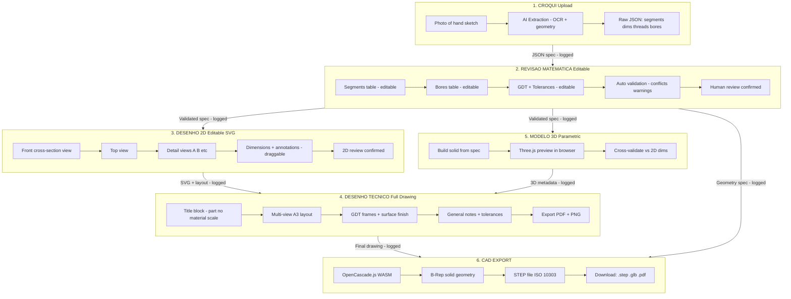

# Desenho Técnico Pipeline: Croqui → STEP

## Pipeline Overview

---

## Step-by-Step Detail

### Step 1: CROQUI (Upload)
**Input:** Photo of a hand-drawn sketch (like the hexagono M12 sketch)
**What happens:**
- User uploads photo + enters part title and notes
- AI extracts geometry: segments (cylinders, tapers, hex, threads), bores, dimensions
- Output: Raw `ExtractionResult` JSON with confidence scores per field
**Editable?** No — this is extraction. Editing happens in Step 2.
**Logged?** Yes — raw extraction stored in session record with extraction source tag.

### Step 2: REVISÃO MATEMÁTICA (Editable Math Review)
**Input:** Raw extraction JSON
**What the user sees:**
- **Segments table** — each segment row: label, kind (cylinder/taper/hex/thread), length, start diameter, end diameter, across-flats, thread spec, pitch. All fields editable inline.
- **Bores table** — bore label, diameter, depth, start side. Editable.
- **GD&T section** — governing standard (ASME/ISO), datum features, feature control frames. Editable.
- **Tolerances** — general tolerance class, per-dimension tolerance overrides. Editable.
- **Auto-validation** — runs live as user edits. Shows blocking errors (red), review-required (blue), warnings (amber), info (gray).
- **Ambiguity panel** — AI-flagged uncertainties with "resolve" buttons.
**Output:** Validated `AxisymmetricPartSpec` + `EngineeringDrawingSemanticDocument`
**Editable?** YES — every field. This is the source of truth.
**Logged?** YES — every save creates a diff log entry (field, old value, new value, timestamp).

### Step 3: DESENHO 2D (Editable SVG Views)
**Input:** Validated spec from Step 2
**What the user sees:**
- **Front cross-section view** — main orthographic projection with hatching for cut sections
- **Top view** — showing hex/square profiles, bore locations
- **Detail views** — zoomed callouts for threads, chamfers, radii
- **Dimension lines + annotations** — draggable/repositionable on the canvas
- **Surface finish symbols** (Ra values)
**Output:** Multi-view SVG layout ready for composition into full drawing
**Editable?** YES — user can:
  - Reposition dimension lines and annotations (drag)
  - Add/remove detail views
  - Toggle which views to include
  - Override annotation text
**Logged?** YES — layout changes stored as diffs.

### Step 4: DESENHO TÉCNICO (Full Technical Drawing)
**Input:** 2D views from Step 3 + 3D metadata from Step 5 + spec from Step 2
**What the user sees:** A complete A3-format technical drawing like the example image, containing:
- **Title block** — part number, revision, material (Aço Inoxidável), scale (1:1), date, drafter name, tolerance standard (ISO 2768-m)
- **Multiple views** composed in standard engineering layout:
  - A) Main cross-section view (front)
  - B) Top view
  - C) Side sections
  - D) Detail views (thread details, bore details)
  - E) Enlarged details
- **GD&T frames** — perpendicularity, position, concentricity callouts with datum references
- **Surface finish callouts** — Ra 0.4 etc.
- **General notes** — dimensions in mm, surface finish spec, thread spec
- **Conflict notes** — any dimension conflicts flagged from validation
**Output:** Final drawing as PDF (A3) + PNG
**Editable?** YES — title block fields editable, views can be repositioned, notes editable
**Logged?** YES — full audit trail of the drawing package.

### Step 5: MODELO 3D (Parametric Preview)
**Input:** Validated spec from Step 2
**What happens:**
- Parametric solid built from revolution geometry (axisymmetric parts)
- Three.js interactive preview in the browser (orbit, zoom, pan)
- Cross-validation: 3D bounding box checked against 2D dimensions
**Output:** 3D mesh + validation report
**Editable?** View-only (edits go back to Step 2 spec, which regenerates 3D)
**Logged?** YES — mesh summary, bounding box, validation results.
**Note:** This is a preview/validation tool. The real 3D output is the STEP file in Step 6.

### Step 6: CAD EXPORT (STEP File)
**Input:** Validated spec from Step 2
**What happens:**
- **OpenCascade.js** (WebAssembly port of the Open CASCADE Technology kernel) builds B-Rep solid geometry
- Segments → revolution solids (BRepPrimAPI_MakeRevol)
- Bores → subtracted cylinders (BRepAlgoAPI_Cut)
- Hex/square → extruded prisms
- Threads → helix + swept profile (cosmetic or real geometry)
- Output: STEP file (ISO 10303-21 AP214)
**Output:** Downloadable files:
  - `.step` — CAD-ready, importable in SolidWorks, Fusion 360, CATIA, etc.
  - `.glb` — lightweight 3D for web preview
  - `.pdf` — the full technical drawing from Step 4
**Editable?** No — this is export. Go back to Step 2 to edit, then regenerate.
**Logged?** YES — export event logged with file sizes, generation time, spec hash.

---

## Key Principles

1. **No black boxes** — every step shows its inputs, outputs, and intermediate state
2. **Everything editable** — the math spec (Step 2) is the single source of truth; everything downstream regenerates from it
3. **Everything logged** — field-level diffs, timestamps, who changed what
4. **Human review gates** — Steps 2 and 3 require explicit human confirmation before proceeding
5. **Incremental** — you can stop at any step and resume later (session persistence)

---

## Technology Stack per Step

| Step | Frontend | Backend | Key Library |
|------|----------|---------|-------------|
| 1. Croqui/PPTX/PDF | React upload + fixture picker | Edge Function (AI extraction) | OpenRouter + `openai/gpt-5.4` |
| 2. Revisão | Editable tables + live validation | — (client-side) | Custom validation engine |
| 3. Desenho 2D | SVG canvas + drag annotations | Edge Function (render2d) | Custom SVG renderer |
| 4. Desenho Técnico | A3 layout compositor | Edge Function (compose) | jsPDF + SVG composition |
| 5. Modelo 3D | Three.js / React Three Fiber | — (client-side) | Three.js + GLTFExporter + GLB viewer |
| 6. CAD Export | Download buttons | Edge Function or WASM | **opencascade.js** (WASM) |

---

## What Exists Today (V1) vs What's Needed

| Capability | V1 (current branch) | Target |
|-----------|---------------------|--------|
| Croqui upload | ✅ Works | ✅ Keep |
| AI extraction | ⚠️ OpenRouter vision + manual PPTX/PDF fallback | 🔧 Parser estrutural PPTX/PDF + feedback Ronaldo |
| Math review (editable tables) | ✅ Works | ✅ Keep, add diff logging |
| GD&T review | ✅ Works | ✅ Keep |
| 2D SVG render | ✅ Single cross-section | 🔧 Multi-view + top view + details |
| Editable annotations | ❌ Static SVG | 🔧 Draggable annotations |
| Full technical drawing (A3) | ✅ Basic A3 SVG/PDF/PPTX | 🔧 Title block + multi-view composition |
| 3D preview | ✅ Three.js basic + GLB saved asset viewer | ✅ Keep as validation tool |
| STEP export | ⚠️ Preliminary export | 🔧 Validate in SolidWorks and improve geometry fidelity |
| Audit logging | ❌ Not started | 🔧 Field-level diffs |

---

## OpenCascade.js for STEP Export

[opencascade.js](https://github.com/nicholasgasior/opencascade.js) is a full WASM port of the
Open CASCADE Technology (OCCT) CAD kernel. It can:

- Build B-Rep solids (cylinders, cones, revolutions, extrusions, boolean operations)
- Export to STEP (AP203/AP214), IGES, BREP, STL
- Run entirely in the browser (no server needed) or in a Deno/Node backend
- Bundle size: ~15-25 MB WASM (load on demand, not on page load)

For axisymmetric parts like LifeTrek's, the geometry is straightforward:
1. Define the profile as a 2D wire (from the segment spec)
2. Revolve around the axis → solid of revolution
3. Cut bores (boolean subtract cylinders)
4. Add hex/square features (boolean operations)
5. Write to STEP

This is a proven approach — many web-based CAD tools (e.g., CadHub, CascadeStudio) use it.
