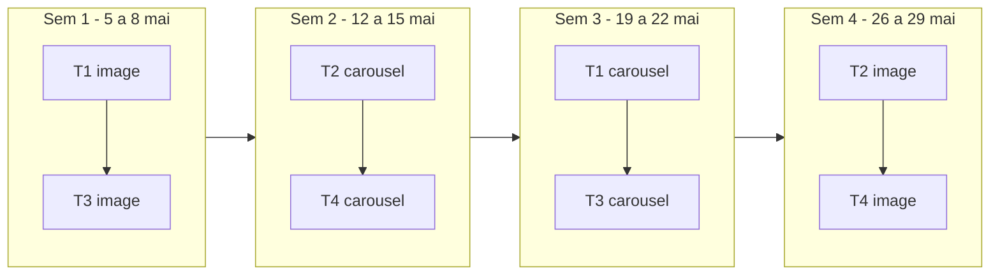
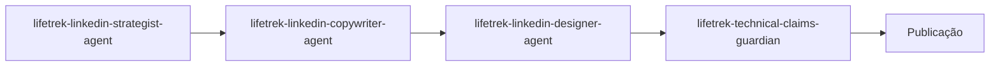

# LinkedIn — Plano de execução do teste de 4 semanas (mai-2026)

**Janela:** terça 5-mai-2026 a quinta 28-mai-2026
**Cadência:** 2 posts/semana (terça + quinta)
**Volume:** 8 posts editoriais
**Origem:** análise preditiva e de clusters em [output/linkedin_post_audit/linkedin_modeling_summary_2026-05-01.json](../../output/linkedin_post_audit/linkedin_modeling_summary_2026-05-01.json)
**Última atualização:** 2026-05-01

---

## 1. Sumário das 5 recomendações (ancoradas em dados)

As cinco direções abaixo vieram da rodada de modelagem de 2026-05-01 sobre 28 posts publicados desde 2026-01-21. Cada uma é traduzida em uma decisão operacional clara e em um coeficiente do CSV de regressão.

| # | Recomendação | Evidência ([linkedin_regression_coefficients_2026-05-01.csv](../../output/linkedin_post_audit/linkedin_regression_coefficients_2026-05-01.csv)) | Decisão operacional |
|---|---|---|---|
| 1 | Rodar 4 semanas, 2 posts/sem em Operações/Capacidade e Metrologia/Validação, mantendo formato visual parecido para isolar o efeito do tema. | `topic_Operations / Capacity` β=+0,70 e `topic_Metrology / Validation` β=+0,49 sobre impressões — os dois maiores coeficientes positivos do modelo. | 4 temas (2 por vertical), cada um postado 2x. Direção visual limpa e consistente, com prioridade para plain image/foto hiper-realista. |
| 2 | Abrir com tensão operacional concreta: capacidade não é máquina, validação não é inspeção final, gargalo nem sempre está na usinagem. | Top cluster (4 posts, média 663 impressões) tem 100% de hooks em afirmação, comprimento médio 113 chars, vs 74 no resto ([linkedin_top_cluster_driver_lifts_2026-05-01.csv](../../output/linkedin_post_audit/linkedin_top_cluster_driver_lifts_2026-05-01.csv)). | Hook obrigatoriamente afirmativo, 95–125 chars, ancorado em risco específico. |
| 3 | Separar posts institucionais, vagas e anúncios da análise editorial. | 3 posts foram excluídos como outliers em [linkedin_modeling_excluded_outliers_2026-05-01.csv](../../output/linkedin_post_audit/linkedin_modeling_excluded_outliers_2026-05-01.csv). Sem rótulo, eles voltam a poluir o próximo modelo. | Adicionar campo `post_class` com valores `editorial` / `institutional` / `recruiting_or_announcement`. Só `editorial` entra no dataset de modelagem. |
| 4 | Não concluir que carrossel é ruim. O sinal negativo pode ser amostra pequena e tema. | `is_carousel` β=-0,21 em impressões sem controle, mas β=+0,045 quando `impressions` entra como exposição (`reactions_with_impressions_exposure`, R²=0,94). | Testar mesmo tema em single-image e em carrossel, com hook e mensagem-chave idênticos. |
| 5 | Repetir a estrutura dos melhores posts: risco específico → por que o processo comum falha → evidência Lifetrek → resultado para OEM. | Top cluster combina hook em afirmação + legenda média de 107 palavras (vs 152 no resto) + topic_group em Metrologia ou Operações. | Estrutura narrativa fixa de 4 blocos para os 8 posts. Legenda alvo 95–115 palavras. |

---

## 2. Desenho experimental

Fatorial **2 verticais × 2 formatos × 2 réplicas = 8 posts**.

- **Verticais:** Operações/Capacidade (T1, T2) e Metrologia/Validação (T3, T4).
- **Formatos:** single-image e carrossel de 5 slides.
- **Réplicas:** cada um dos 4 temas roda 1x em cada formato, separados por 2 semanas para reduzir overlap de audiência.
- **Constantes:** estrutura narrativa, direção visual limpa, faixa de palavras, hook em afirmação.
- **Variáveis:** vertical e formato.



---

## 3. Calendário detalhado

| Semana | Data | Dia | Tema | Vertical | Formato | Brief |
|---|---|---|---|---|---|---|
| 1 | 2026-05-05 | terça | T1 — Capacidade não é máquina | Ops/Capacity | image | [Apêndice B1](#b1--t1-image--terça-5-mai) |
| 1 | 2026-05-07 | quinta | T3 — Validação não é inspeção final | Metro/Validation | image | [Apêndice B2](#b2--t3-image--quinta-7-mai) |
| 2 | 2026-05-12 | terça | T2 — O gargalo nem sempre está na usinagem | Ops/Capacity | carousel | [Apêndice B3](#b3--t2-carousel--terça-12-mai) |
| 2 | 2026-05-14 | quinta | T4 — Sem MSA, sua tolerância é incerta | Metro/Validation | carousel | [Apêndice B4](#b4--t4-carousel--quinta-14-mai) |
| 3 | 2026-05-19 | terça | T1 — Capacidade não é máquina | Ops/Capacity | carousel | [Apêndice B5](#b5--t1-carousel--terça-19-mai) |
| 3 | 2026-05-21 | quinta | T3 — Validação não é inspeção final | Metro/Validation | carousel | [Apêndice B6](#b6--t3-carousel--quinta-21-mai) |
| 4 | 2026-05-26 | terça | T2 — O gargalo nem sempre está na usinagem | Ops/Capacity | image | [Apêndice B7](#b7--t2-image--terça-26-mai) |
| 4 | 2026-05-28 | quinta | T4 — Sem MSA, sua tolerância é incerta | Metro/Validation | image | [Apêndice B8](#b8--t4-image--quinta-28-mai) |

### 3.1 Plano visual por post (LinkedIn)

- **Plain/hyperreal sem overlay pesado (5 posts):** B1, B2, B5, B7, B8.
- **Overlay textual mínimo (3 posts):** B3, B4, B6.
- Regra do teste: overlay somente quando necessário para leitura do hook; evitar cards complexos.

---

## 4. Constantes do experimento

Travadas para todos os 8 posts. Qualquer desvio invalida a leitura comparativa.

### 4.1 Hook
- Tipo: afirmação (nunca pergunta).
- Comprimento: 95–125 chars.
- Conteúdo: tensão operacional concreta, com substantivo técnico (capacidade, validação, gargalo, MSA, IQ/OQ/PQ, Cpk, NC, lote piloto).

### 4.2 Estrutura narrativa fixa (4 blocos)
1. **Risco específico** — qual decisão de OEM falha quando esse tema é tratado de forma rasa.
2. **Por que o processo comum falha** — hipótese errada que a maioria do mercado adota.
3. **Evidência Lifetrek** — máquina, sala, certificação ou rotina concreta de [docs/brand/COMPANY_CONTEXT.md](../brand/COMPANY_CONTEXT.md).
4. **Resultado para o OEM** — o que muda no lead time, no Cpk, na NC ou na auditoria.

### 4.3 Legenda
- Alvo: 95–115 palavras (média do top cluster: 107).
- Sem CTA de DM/comentário.
- Encerrar com afirmação técnica seca + diamond sparkle (`◆`).

### 4.4 Direção visual (LinkedIn)
- Prioridade: **plain image** (real Lifetrek) ou imagem **AI fotorrealista hiper-resolução** com baixo ruído visual.
- Overlay de texto: usar em **minoria dos posts** (aprox. 3 de 8), sempre minimalista.
- Nos demais posts (maioria), usar imagem limpa com no máximo micro-label técnico discreto.
- Evitar composições muito “design-heavy” para não confundir efeito de tema com efeito de layout.
- Manter consistência de paleta (Corporate Blue `#004F8F`) quando houver elementos gráficos.

### 4.5 Carrossel
- 5 slides exatos: hook → risco → falha comum → evidência → resultado.
- Mesmas mensagens-chave da versão single-image — só muda a granularidade visual.

### 4.6 Direção visual (Instagram)
- Para Instagram, usar abordagem mais gráfica que LinkedIn.
- Preferir AI/Satori overlays em Reels/cards quando o objetivo for retenção visual no feed.
- Manter a mesma tese técnica do LinkedIn, mas com execução visual mais expressiva.

---

## 5. Governança editorial

### 5.1 Separação de classes (resolve recomendação #3)

Todo post passa a ter um campo `post_class`:

| Valor | Quando usar | Entra no dataset de modelagem? |
|---|---|---|
| `editorial` | Posts da esteira de conteúdo técnico (os 8 deste teste e equivalentes). | Sim. |
| `institutional` | Posts de marca, aniversário, certificação, presença em feira, RH institucional. | Não. |
| `recruiting_or_announcement` | Vagas, lançamento de site, comunicado de mudança comercial. | Não. |

A separação evita que o sinal de tema/formato seja diluído por posts com objetivo diferente.

### 5.2 Pipeline de produção por post



1. **Estrategista** recebe `topic`, `target_audience=Engenheiro/Qualidade OEM`, `content_type=carousel|single_post`, `is_lead_magnet=false`. Saída: JSON de estratégia.
2. **Copywriter** aplica restrições do experimento (hook 95–125 chars em afirmação, legenda 95–115 palavras, sem CTA de DM/comentário).
3. **Designer** aplica direção visual limpa para LinkedIn (plain/hyperreal-first) e marca quais peças usam overlay mínimo.
4. **Technical Claims Guardian** valida cada claim contra [docs/brand/COMPANY_CONTEXT.md](../brand/COMPANY_CONTEXT.md) e [docs/brand/BRAND_BOOK.md](../brand/BRAND_BOOK.md).

---

## 6. Plano de medição

### 6.1 Schema de coleta

Cada post é registrado no mesmo formato de [linkedin_post_content_audit_2026-05-01.csv](../../output/linkedin_post_audit/linkedin_post_content_audit_2026-05-01.csv), com os campos:

- `post_class=editorial` (todos os 8).
- `topic_group` ∈ `Operations / Capacity`, `Metrology / Validation`.
- `post_format_clean` ∈ `Image`, `Carousel`.
- `hook_category=Statement` (todos).
- `hook_length_chars`, `caption_word_count`, `awareness_stage`.
- Snapshot de métricas em **D+7** e **D+14**: impressões, reações, comentários, reposts, CTR, dwell-on-carousel quando disponível.

### 6.2 Critérios de leitura (executados na semana 5)

- **Efeito tema:** comparar média de impressões entre Ops/Cap (4 posts) e Metro/Val (4 posts) com bootstrap (10k iterações). Reportar IC 95%.
- **Efeito formato:** comparar single-image (4) vs carrossel (4) controlando por tema. Reportar diferença média e IC bootstrap.
- **Reproduzir referência:** o top cluster atual tem 4 posts com média de 663 impressões. **Sucesso mínimo:** pelo menos 2 dos 8 novos posts batem 663 impressões em D+14.
- **Hook em afirmação:** confirmar que `hook_category=Statement` mantém ou amplia a vantagem observada.
- **Legenda:** validar que legendas em 95–115 palavras superam a média atual (152 do bottom cluster).

### 6.3 Saída esperada

Ao final, atualizar [output/linkedin_post_audit/linkedin_modeling_summary_2026-05-01.json](../../output/linkedin_post_audit/linkedin_modeling_summary_2026-05-01.json) com nova rodada datada de 2026-06-01 contendo os 8 posts deste teste, separados por `post_class=editorial`.

---

## 7. TODOs de tooling (fora do escopo de implementação aqui)

Documentado para a próxima rodada de modelagem, **não implementado nesta entrega**:

- [ ] Adicionar coluna `post_class` em [output/linkedin_post_audit/build_linkedin_post_audit.mjs](../../output/linkedin_post_audit/build_linkedin_post_audit.mjs) durante a normalização do CSV bruto, com default `editorial` quando ausente.
- [ ] Filtrar `post_class != 'editorial'` na entrada de [output/linkedin_post_audit/analyze_linkedin_post_factors.py](../../output/linkedin_post_audit/analyze_linkedin_post_factors.py) antes de qualquer regressão ou clustering.
- [ ] Atualizar [output/linkedin_post_audit/linkedin_post_content_audit_supabase_upsert_2026-05-01.sql](../../output/linkedin_post_audit/linkedin_post_content_audit_supabase_upsert_2026-05-01.sql) para incluir `post_class` no upsert.
- [ ] Após semana 4, gerar `Lifetrek_LinkedIn_Post_Audit_2026-06-01.xlsx` com a comparação 8 novos vs baseline de 28.

---

## 8. Riscos e mitigações

| Risco | Mitigação |
|---|---|
| Audiência satura no mesmo tema em 4 semanas. | Espaçar mesmo tema em 2 semanas e variar o ângulo dentro do tema (ver briefs B1 vs B5 e B2 vs B6). |
| Algoritmo trata terça e quinta de formas diferentes. | Manter o mesmo dia da semana para a mesma vertical (terça=Ops, quinta=Metro). |
| Mudança de criativo na Família A introduz ruído. | Travar variante por slide tipo (problema=`RiscoDeRecall`, corpo=`ProgrammaticCarrousel`). |
| Posts institucionais publicados na janela poluem o sinal. | Marcá-los `post_class != editorial` e excluí-los do dataset. |
| Amostra de 8 ainda é pequena para significância estatística forte. | Reportar IC bootstrap em vez de p-values e tratar a leitura como direcional, não conclusiva. |

---

# Apêndice — 8 Briefs editoriais

Cada brief é o input direto para o `lifetrek-linkedin-strategist-agent`. O copywriter recebe o JSON de estratégia gerado e produz o texto final respeitando as constantes da seção 4. Todos os briefs assumem `is_lead_magnet=false`, `target_audience=Engenheiro/Qualidade/Operações de OEM médico` e `awareness_stage=Problem-aware`.

Regra transversal do apêndice:

- Se houver conflito entre detalhe visual do brief e a seção 4.4, prevalece a seção 4.4.
- `plain/hyperreal` é o padrão. Overlay textual deve ser mínimo e aplicado apenas aos briefs B3, B4 e B6.

## B1 — T1 image — terça 5-mai

```yaml
post_id: 2026-05-05-T1-image
post_class: editorial
topic: "Capacidade real em manufatura médica não é número de máquinas"
topic_group: Operations / Capacity
content_type: single_post
format_target: Image
hook_alvo: "Capacidade não é máquina. É hora usinável vezes confiabilidade vezes setup vezes metrologia."
hook_length_target_chars: 110
caption_word_count_target: [95, 115]
linkedin_visual_treatment: plain_hyperreal_no_overlay

bloco_1_risco_especifico: >
  OEM aprova um fornecedor olhando lista de máquinas. No primeiro pico de demanda
  descobre que o lead time real depende de setup, MSA e disponibilidade de CMM.

bloco_2_falha_comum: >
  Confundir CAPEX em CNC com aumento de output. Comprar máquina sem revisar
  setup, troca rápida, manutenção preventiva e janela de metrologia.

bloco_3_evidencia_lifetrek: >
  Mix Citizen L20 + M32 + Doosan Lynx 2100 + FANUC Robodrill operado com setup
  curto e ZEISS Contura dedicada à validação dimensional em fluxo.

bloco_4_resultado_oem: >
  Lead time previsível em geometria complexa. O cronograma do OEM não trava
  quando o lote dobra.

key_messages:
  - "Capacidade efetiva é função de quatro variáveis, não só do número de tornos."
  - "A janela de metrologia é tão crítica quanto a capacidade de usinagem."
  - "Setup curto é o multiplicador escondido de capacidade."

prova_lifetrek_referencia:
  - "docs/brand/COMPANY_CONTEXT.md §2: máquinas Citizen, Doosan, FANUC."
  - "docs/brand/COMPANY_CONTEXT.md §2: ZEISS Contura 1.9 + L/300 μm."

visual_family: A
visual_variant: ProgrammaticCarrousel.jpeg
```

## B2 — T3 image — quinta 7-mai

```yaml
post_id: 2026-05-07-T3-image
post_class: editorial
topic: "Validação de processo não é inspeção final de peça"
topic_group: Metrology / Validation
content_type: single_post
format_target: Image
hook_alvo: "Validação não é inspeção final. É IQ, OQ e PQ documentados antes do primeiro lote comercial."
hook_length_target_chars: 105
caption_word_count_target: [95, 115]
linkedin_visual_treatment: plain_hyperreal_no_overlay

bloco_1_risco_especifico: >
  OEM aceita fornecedor com base em relatório dimensional do lote piloto. Na
  auditoria ANVISA, falta protocolo de validação do processo.

bloco_2_falha_comum: >
  Tratar validação como inspeção 100% do lote. Inspeção não cobre estabilidade
  do processo, capabilidade nem variabilidade entre operadores.

bloco_3_evidencia_lifetrek: >
  Protocolo IQ/OQ/PQ documentado por família de produto, com Cpk monitorado em
  ZEISS Contura e revisão de Gage R&R por turno.

bloco_4_resultado_oem: >
  Redução de não conformidades em auditoria ISO 13485 e tempo menor para
  defesa de documentação técnica em ANVISA.

key_messages:
  - "Inspeção valida peça. Validação valida processo."
  - "Cpk sem MSA é número decorativo."
  - "IQ/OQ/PQ é o que o auditor pede, não o relatório dimensional."

prova_lifetrek_referencia:
  - "docs/brand/COMPANY_CONTEXT.md §2: ZEISS Contura."
  - "docs/brand/COMPANY_CONTEXT.md §1: ISO 13485:2016 e ANVISA."

visual_family: A
visual_variant: RiscoDeRecall.jpeg
```

## B3 — T2 carousel — terça 12-mai

```yaml
post_id: 2026-05-12-T2-carousel
post_class: editorial
topic: "O gargalo de produção médica raramente está na usinagem"
topic_group: Operations / Capacity
content_type: carousel
format_target: Carousel
slide_count: 5
hook_alvo: "O gargalo nem sempre está na usinagem. Está em metrologia, embalagem, lote piloto ou ISO 13485."
hook_length_target_chars: 115
caption_word_count_target: [95, 115]
linkedin_visual_treatment: minimal_overlay_text

slides:
  - slide: 1
    type: hook
    key_message: "O gargalo nem sempre está na usinagem."
    visual_variant: RiscoDeRecall.jpeg
  - slide: 2
    type: problem
    key_message: "OEM investe em CNC e descobre que o gargalo é metrologia, embalagem ou liberação documental."
    visual_variant: ProgrammaticCarrousel.jpeg
  - slide: 3
    type: failure_mode
    key_message: "A análise de capacidade ignora janela de CMM, fluxo de sala limpa e tempo de aprovação documental."
    visual_variant: ProgrammaticCarrousel.jpeg
  - slide: 4
    type: lifetrek_evidence
    key_message: "Sala limpa ISO Classe 7, ZEISS Contura dedicada e rastreabilidade UDI a laser dentro do mesmo fluxo."
    visual_variant: ProgrammaticCarrousel.jpeg
  - slide: 5
    type: oem_outcome
    key_message: "Tempo total até lote aprovado cai porque o ponto crítico foi mapeado fora do CNC. ◆"
    visual_variant: ProgrammaticCarrousel.jpeg

key_messages:
  - "Gargalo é onde para o fluxo, não onde está o CAPEX."
  - "Validação documental e metrologia entram no cálculo de lead time."
  - "Sala limpa e marcação UDI são parte do gargalo, não pós-processo."

prova_lifetrek_referencia:
  - "docs/brand/COMPANY_CONTEXT.md §2: cleanrooms ISO Classe 7."
  - "docs/brand/COMPANY_CONTEXT.md §2: laser marking UDI."

visual_family: A
```

## B4 — T4 carousel — quinta 14-mai

```yaml
post_id: 2026-05-14-T4-carousel
post_class: editorial
topic: "MSA antes de Cpk: por que sua tolerância pode ser incerta"
topic_group: Metrology / Validation
content_type: carousel
format_target: Carousel
slide_count: 5
hook_alvo: "Sem MSA, sua tolerância é incerta. Cpk em sistema de medição não validado é número decorativo."
hook_length_target_chars: 110
caption_word_count_target: [95, 115]
linkedin_visual_treatment: minimal_overlay_text

slides:
  - slide: 1
    type: hook
    key_message: "Sem MSA, sua tolerância é incerta."
    visual_variant: RiscoDeRecall.jpeg
  - slide: 2
    type: problem
    key_message: "OEM aprova fornecedor com Cpk alto. O sistema de medição nunca passou por Gage R&R."
    visual_variant: ProgrammaticCarrousel.jpeg
  - slide: 3
    type: failure_mode
    key_message: "MSA negligenciada faz a variabilidade do instrumento entrar no Cpk como se fosse processo."
    visual_variant: ProgrammaticCarrousel.jpeg
  - slide: 4
    type: lifetrek_evidence
    key_message: "ZEISS Contura com Gage R&R rotineiro por família de produto e operador qualificado."
    visual_variant: ProgrammaticCarrousel.jpeg
  - slide: 5
    type: oem_outcome
    key_message: "Decisões de aceitação de lote com confiança real, não com falsa precisão. ◆"
    visual_variant: ProgrammaticCarrousel.jpeg

key_messages:
  - "Cpk válido pressupõe sistema de medição validado."
  - "Gage R&R é parte do processo, não auditoria pontual."
  - "Operador qualificado entra na equação de variabilidade."

prova_lifetrek_referencia:
  - "docs/brand/COMPANY_CONTEXT.md §2: ZEISS Contura 1.9 + L/300 μm."

visual_family: A
```

## B5 — T1 carousel — terça 19-mai

```yaml
post_id: 2026-05-19-T1-carousel
post_class: editorial
topic: "Anatomia da capacidade real em manufatura médica"
topic_group: Operations / Capacity
content_type: carousel
format_target: Carousel
slide_count: 5
hook_alvo: "Capacidade não é máquina. É hora usinável vezes confiabilidade vezes setup vezes metrologia."
hook_length_target_chars: 110
caption_word_count_target: [95, 115]
linkedin_visual_treatment: plain_hyperreal_no_overlay

slides:
  - slide: 1
    type: hook
    key_message: "Capacidade não é máquina."
    visual_variant: RiscoDeRecall.jpeg
  - slide: 2
    type: problem
    key_message: "OEM aprova fornecedor pela contagem de tornos. O lead time real é função de outras quatro variáveis."
    visual_variant: ProgrammaticCarrousel.jpeg
  - slide: 3
    type: failure_mode
    key_message: "Hora usinável é o que sobra depois de manutenção, troca, calibração e fila de metrologia."
    visual_variant: ProgrammaticCarrousel.jpeg
  - slide: 4
    type: lifetrek_evidence
    key_message: "Mix Citizen L20 + M32 + Doosan + FANUC operado com setup curto e ZEISS Contura em fluxo."
    visual_variant: ProgrammaticCarrousel.jpeg
  - slide: 5
    type: oem_outcome
    key_message: "Lead time previsível mesmo quando o pedido dobra. ◆"
    visual_variant: ProgrammaticCarrousel.jpeg

key_messages:
  - "Capacidade real = hora usinável × confiabilidade × setup × metrologia."
  - "Setup curto multiplica capacidade efetiva sem CAPEX novo."
  - "Janela de metrologia é parte da capacidade, não pós-processo."

prova_lifetrek_referencia:
  - "docs/brand/COMPANY_CONTEXT.md §2: parque CNC e ZEISS Contura."

visual_family: A
```

## B6 — T3 carousel — quinta 21-mai

```yaml
post_id: 2026-05-21-T3-carousel
post_class: editorial
topic: "IQ, OQ e PQ: o que o auditor pede que a inspeção não cobre"
topic_group: Metrology / Validation
content_type: carousel
format_target: Carousel
slide_count: 5
hook_alvo: "Validação não é inspeção final. É IQ, OQ e PQ documentados antes do primeiro lote comercial."
hook_length_target_chars: 105
caption_word_count_target: [95, 115]
linkedin_visual_treatment: minimal_overlay_text

slides:
  - slide: 1
    type: hook
    key_message: "Validação não é inspeção final."
    visual_variant: RiscoDeRecall.jpeg
  - slide: 2
    type: problem
    key_message: "OEM aprova fornecedor pelo relatório dimensional do lote piloto. O auditor pede IQ/OQ/PQ."
    visual_variant: ProgrammaticCarrousel.jpeg
  - slide: 3
    type: failure_mode
    key_message: "Inspeção 100% não prova estabilidade nem capabilidade do processo."
    visual_variant: ProgrammaticCarrousel.jpeg
  - slide: 4
    type: lifetrek_evidence
    key_message: "Protocolo IQ/OQ/PQ por família, Cpk monitorado em ZEISS Contura, MSA por turno."
    visual_variant: ProgrammaticCarrousel.jpeg
  - slide: 5
    type: oem_outcome
    key_message: "Defesa documental ANVISA mais curta. Menos NCs em auditoria ISO 13485. ◆"
    visual_variant: ProgrammaticCarrousel.jpeg

key_messages:
  - "Inspeção valida peça. Validação valida processo."
  - "IQ/OQ/PQ é o pacote que o auditor abre primeiro."
  - "Cpk monitorado em fluxo > Cpk de lote piloto."

prova_lifetrek_referencia:
  - "docs/brand/COMPANY_CONTEXT.md §1: ISO 13485:2016 e ANVISA."
  - "docs/brand/COMPANY_CONTEXT.md §2: ZEISS Contura."

visual_family: A
```

## B7 — T2 image — terça 26-mai

```yaml
post_id: 2026-05-26-T2-image
post_class: editorial
topic: "Onde realmente está o gargalo no seu fornecedor médico"
topic_group: Operations / Capacity
content_type: single_post
format_target: Image
hook_alvo: "O gargalo nem sempre está na usinagem. Está em metrologia, embalagem, lote piloto ou ISO 13485."
hook_length_target_chars: 115
caption_word_count_target: [95, 115]
linkedin_visual_treatment: plain_hyperreal_no_overlay

bloco_1_risco_especifico: >
  OEM contrata novo CNC esperando dobrar output. Lead time não muda porque o
  gargalo era a janela de metrologia ou a aprovação documental.

bloco_2_falha_comum: >
  Modelar capacidade só pelo CNC. Ignorar fila de CMM, fluxo de sala limpa,
  marcação UDI e tempo de release de qualidade.

bloco_3_evidencia_lifetrek: >
  Sala limpa ISO Classe 7, ZEISS Contura dedicada e laser UDI integrados ao
  mesmo fluxo de produção.

bloco_4_resultado_oem: >
  O ponto de saturação real fica visível antes de virar atraso. Investimento
  vai para onde o fluxo realmente trava.

key_messages:
  - "Gargalo é onde o fluxo para, não onde o CAPEX está concentrado."
  - "Sala limpa e marcação UDI são parte da capacidade, não pós-processo."
  - "Aprovação documental tem fila própria e precisa entrar no cálculo."

prova_lifetrek_referencia:
  - "docs/brand/COMPANY_CONTEXT.md §2: cleanrooms ISO Classe 7 + laser UDI."

visual_family: A
visual_variant: ProgrammaticCarrousel.jpeg
```

## B8 — T4 image — quinta 28-mai

```yaml
post_id: 2026-05-28-T4-image
post_class: editorial
topic: "Cpk sem MSA é número decorativo"
topic_group: Metrology / Validation
content_type: single_post
format_target: Image
hook_alvo: "Sem MSA, sua tolerância é incerta. Cpk em sistema de medição não validado é número decorativo."
hook_length_target_chars: 110
caption_word_count_target: [95, 115]
linkedin_visual_treatment: plain_hyperreal_no_overlay

bloco_1_risco_especifico: >
  OEM aprova fornecedor pelo Cpk alto do lote piloto. Em produção, a
  variabilidade real do processo aparece e o lote começa a ser rejeitado.

bloco_2_falha_comum: >
  Calcular Cpk antes de validar o sistema de medição. A variabilidade do
  instrumento e do operador entra no número como se fosse processo.

bloco_3_evidencia_lifetrek: >
  ZEISS Contura calibrada por padrão rastreável, Gage R&R rotineiro por
  família e operador qualificado.

bloco_4_resultado_oem: >
  Decisões de aceitação de lote com confiança real. Menos retrabalho, menos
  rejeição em recebimento.

key_messages:
  - "MSA é pré-requisito de Cpk."
  - "Gage R&R rotineiro > Gage R&R pontual."
  - "Variabilidade do operador entra na equação."

prova_lifetrek_referencia:
  - "docs/brand/COMPANY_CONTEXT.md §2: ZEISS Contura."

visual_family: A
visual_variant: RiscoDeRecall.jpeg
```
