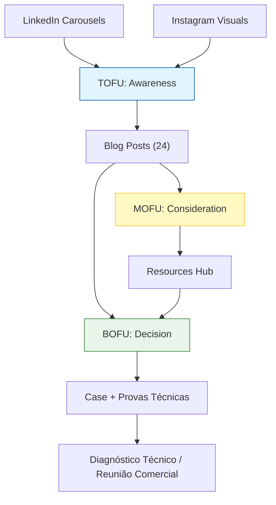

# Lifetrek Intentional Content Strategy

## Escopo e regra inegociável

Este funil é exclusivamente sobre **Lifetrek Medical**.

- Não usar nomes de outros clientes/consultorias (ex: ASC, Amorim Stout Consulting).
- Não usar exemplos que desviem da proposta de valor da Lifetrek.
- Todo conteúdo deve reforçar: manufatura de precisão, qualidade, metrologia, compliance quando relevante e redução de risco na cadeia.
- Regra regulatória obrigatória (ANVISA): para materiais de "migração para produção local", o ICP elegível é empresa com atividade fabril no Brasil (própria ou etapa controlada). Distribuidores/importadores sem fábrica local não são ICP.

## Marketing Funnel (com blogs como pilar central)

Cada conteúdo precisa ter papel claro no caminho até reunião comercial.

Para distribuição recorrente no LinkedIn, usar o sistema documentado em [Lifetrek LinkedIn Newsletter System](./lifetrek-linkedin-newsletter-system.md): blog/recurso como fonte canônica, newsletter como adaptação editorial e feed como peça curta de distribuição.

## Distribuição dos 24 blogs (até 31/05/2026)

Para evitar saturação regulatória, o mix editorial deve ser:

- 8 posts: engenharia de manufatura e processo
- 6 posts: qualidade e metrologia
- 4 posts: supply chain, risco e mercado
- 4 posts: regulatório (ANVISA/ISO, apenas quando tema pedir)
- 2 posts: prova social / casos / capacidades Lifetrek

Regra de sequência:

- **Máximo 2 posts regulatórios seguidos**.
- Sempre alternar com processo, qualidade, metrologia ou supply chain.

## ICP-First (Quem Atendemos)

Cada blog deve declarar ICP primário e ICP secundário no metadata:

- `MI`: Fabricantes de Implantes e Instrumentais Cirúrgicos
- `OD`: Empresas de Equipamentos Odontológicos
- `VT`: Empresas Veterinárias
- `HS`: Instituições de Saúde
- `CM`: Parceiros de Manufatura Contratada / OEM

Campos obrigatórios no `metadata` de `blog_posts` e `resources`:

- `icp_primary`
- `icp_secondary`
- `icp_specificity_scores` (MI/OD/VT/HS/CM)
- `cta_mode` (`article_only`, `diagnostico`, `resource_optional`) — `diagnostico` é o valor técnico do enum para "diagnóstico"
- `pillar_keyword`
- `entity_keywords`
- `locale` (`pt-BR` para conteúdo público em português)
- `translation_ready`

Regra de publicação:

- Bloquear publicação sem `icp_primary` e `pillar_keyword`.
- Todo conteúdo público em português deve ser acentuado em título, descrição, corpo, CTA e metadados visíveis.
- Checklists de recursos devem usar `- [ ]` no Markdown para renderizar itens clicáveis no site e manter o material baixável em formato compatível com Notion/Docs.
- Priorizar `MI`, `OD` e `VT` quando o tema envolver implantes, instrumentais, lote, rastreabilidade, metrologia, DFM ou transferência técnica.

## Mapeamento por etapa do funil

| Funnel Stage | Conteúdo | Objetivo | CTA |
| :--- | :--- | :--- | :--- |
| **TOFU** | Carrossel LinkedIn + blog técnico introdutório | Gerar descoberta e interesse técnico | "Acesse o artigo completo" |
| **MOFU** | Blog técnico aprofundado | Educar e qualificar lead | "Aprofundar critérios técnicos com a Lifetrek" |
| **BOFU** | Blog de decisão (risco, ROI, validação, transição de fornecedor) | Reduzir risco percebido e acelerar decisão | "Agendar diagnóstico técnico com a Lifetrek" |

## Política de lead magnet

- Regra padrão: o próprio blog é o lead magnet.
- Material complementar (checklist/guia) é opcional, apenas quando houver ganho claro de conversão.
- Priorizar `resource_optional` em temas BOFU de alta fricção técnica.

## Regras de qualidade editorial dos blogs

- Linguagem técnica, objetiva, sem hype.
- Conteúdo orientado a problema real de OEM/engenharia/qualidade.
- Abertura do artigo com dor real do ICP primário.
- Encerramento com CTA técnico de decisão (não CTA genérico de marketing).
- Não forçar ANVISA em temas que não são regulatórios.
- Quando citar ANVISA em tema de produção local, incluir disclaimer de elegibilidade (excluir distribuidores/escritório comercial sem etapa fabril local).
- Incluir seções de referência com fontes válidas.
- Nunca citar clientes externos não aprovados.

## Regras SEO/AIO por blog

- `seo_title` entre 40 e 65 caracteres.
- `seo_description` entre 140 e 160 caracteres.
- 3+ keywords relevantes.
- Capa horizontal em `featured_image`.
- 4+ fontes em `metadata.sources`.
- Seção `Referências` no conteúdo.
- FAQ (3+ perguntas) quando aplicável.

## Execução operacional

O fluxo de execução deve:

1. Gerar tema e ângulo com intenção de funil (TOFU/MOFU/BOFU).
2. Produzir rascunho técnico com foco em Lifetrek.
3. Validar SEO/AIO + fontes.
4. Submeter para aprovação interna (stakeholders).
5. Publicar/agendar conforme calendário até 31/05/2026.
