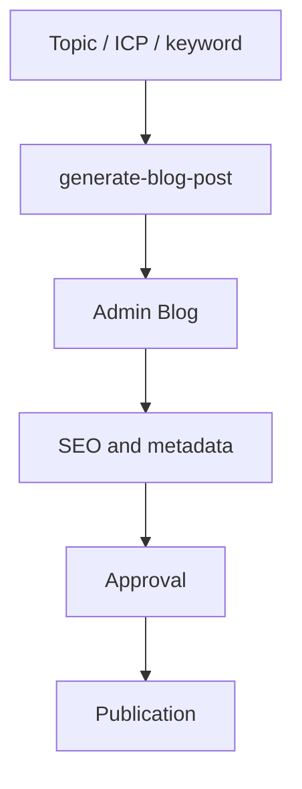

# Blog Generation System

## Overview

The blog is a strategic channel for Lifetrek's technical content. The system combines assisted generation, human editing, technical SEO, and approval before publication. The goal is not auto-publishing, but speeding up article production while keeping quality high enough for consultative selling and technical education.

## Main Flow

1. Define topic, ICP, and pillar keyword.
2. Generate strategy and technical draft.
3. Edit title, summary, content, SEO, and CTA in Admin Blog.
4. Validate required metadata.
5. Approve internally.
6. Publish.

## Components

### Edge Function

`supabase/functions/generate-blog-post`

Responsibilities:

- generate article strategy;
- execute research/context loading when available;
- produce a Brazilian Portuguese draft;
- create title, slug, summary, SEO title, and SEO description;
- return keywords, tags, and references;
- save as draft or `pending_review` in async flows.

### Admin Interface

`src/pages/Admin/AdminBlog.tsx`

Responsibilities:

- list and edit posts;
- create and update articles;
- manage status;
- edit content;
- configure ICP, pillar keyword, entity keywords, tags, and CTA;
- open posts directly via `?edit=`.

### Hooks and Types

- `src/hooks/useBlogPosts.ts`
- `src/types/blog.ts`

These files centralize approval/publication validation, metadata types, and CRUD operations.

## Data Model

### `blog_posts`

Important fields:

- `title`
- `slug`
- `excerpt`
- `content`
- `featured_image`
- `hero_image_url`
- `status`
- `seo_title`
- `seo_description`
- `keywords`
- `tags`
- `published_at`
- `metadata.icp_primary`
- `metadata.pillar_keyword`
- `metadata.entity_keywords`
- `metadata.cta_mode`

### `blog_categories`

Used to organize editorial themes and navigation.

## Approval Rules

Before approval or publication, the article must have:

- non-empty content;
- primary ICP;
- pillar keyword;
- minimum SEO metadata;
- human technical review.

## Editorial Guidelines

- Brazilian Portuguese.
- Direct, technical tone.
- Engineer-to-engineer language.
- Avoid vague commercial promises.
- Avoid unsupported medical claims.
- Use manufacturing, quality, and traceability examples when relevant.
- Do not mention internal automation, CRM, AI, or clients unless explicitly necessary.

## Images

Blog images are editorial support. They may use existing assets, real Lifetrek photos, or assisted generation when appropriate. The image should not be treated as the system's main differentiator.

## Legacy

Older workflows using external scripts, automations, and heavier visual generation should be treated as legacy or auxiliary. The preferred path is:

`generate-blog-post` + review/editing in Admin Blog + approval + publication.

## Recommended Next Improvements

1. Improve editorial prompt quality by ICP type.
2. Add a technical review checklist inside the editor.
3. Connect analytics performance to future article planning.
4. Improve source and reference auditability.
5. Add editorial views by SEO cluster/pillar.
