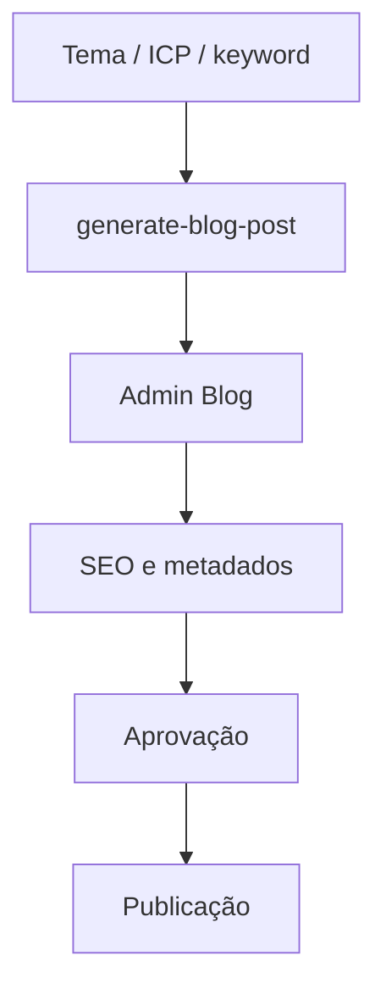

# Sistema de Blog Generation

## Visão Geral

O blog é um canal estratégico para conteúdo técnico da Lifetrek. O sistema combina geração assistida, edição humana, SEO técnico e aprovação antes da publicação. A meta não é publicar automaticamente, mas acelerar a produção de artigos com qualidade suficiente para venda consultiva e educação técnica.

## Fluxo Principal

1. Definir tema, ICP e palavra-chave pilar.
2. Gerar estratégia e rascunho técnico.
3. Editar título, resumo, conteúdo, SEO e CTA no Admin Blog.
4. Validar metadados obrigatórios.
5. Aprovar internamente.
6. Publicar.

## Componentes

### Edge Function

`supabase/functions/generate-blog-post`

Responsabilidades:

- gerar estratégia de artigo;
- executar pesquisa/contexto quando disponível;
- produzir rascunho em português do Brasil;
- criar título, slug, resumo, SEO title e SEO description;
- retornar keywords, tags e referências;
- salvar como rascunho ou `pending_review` quando usado em modo assíncrono.

### Admin Interface

`src/pages/Admin/AdminBlog.tsx`

Responsabilidades:

- listar e editar posts;
- criar e atualizar artigos;
- gerenciar status;
- editar conteúdo;
- configurar ICP, palavra-chave pilar, entity keywords, tags e CTA;
- acessar post diretamente por query `?edit=`.

### Hooks e tipos

- `src/hooks/useBlogPosts.ts`
- `src/types/blog.ts`

Esses arquivos concentram validações de aprovação/publicação, tipos de metadata e operações CRUD.

## Modelo de Dados

### `blog_posts`

Campos importantes:

- `title`
- `slug`
- `excerpt`
- `content`
- `featured_image`
- `hero_image_url`
- `status`
- `seo_title`
- `seo_description`
- `keywords`
- `tags`
- `published_at`
- `metadata.icp_primary`
- `metadata.pillar_keyword`
- `metadata.entity_keywords`
- `metadata.cta_mode`

### `blog_categories`

Usado para organizar temas editoriais e navegação.

## Regras de Aprovação

Antes de aprovar ou publicar, o artigo deve ter:

- conteúdo não vazio;
- ICP primário;
- palavra-chave pilar;
- metadados mínimos de SEO;
- revisão técnica humana.

## Diretrizes Editoriais

- Português do Brasil.
- Tom técnico e direto.
- Linguagem engenheiro-para-engenheiro.
- Evitar promessas comerciais vagas.
- Evitar claims médicos não comprovados.
- Usar exemplos de manufatura, qualidade e rastreabilidade quando fizer sentido.
- Não mencionar automações internas, CRM, IA ou clientes sem necessidade explícita.

## Imagens

Imagens de blog são suporte editorial. Elas podem usar assets existentes, fotos reais da Lifetrek ou geração assistida quando apropriado. A imagem não deve ser tratada como o diferencial principal do sistema.

## Legado

Fluxos antigos com scripts externos, automações e geração visual pesada devem ser considerados legados ou auxiliares. O caminho preferido é:

`generate-blog-post` + revisão/edição no Admin Blog + aprovação + publicação.

## Próximas Melhorias Recomendadas

1. Melhorar qualidade do prompt editorial por tipo de ICP.
2. Adicionar checklist de revisão técnica dentro do editor.
3. Conectar performance de analytics ao planejamento de novos artigos.
4. Melhorar auditoria de fontes e referências.
5. Criar visão editorial por cluster/pilar de SEO.
