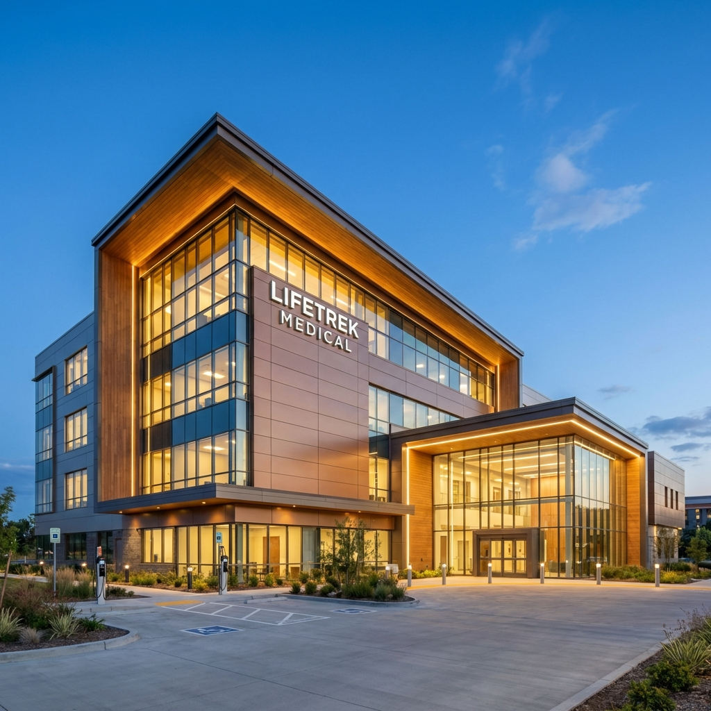
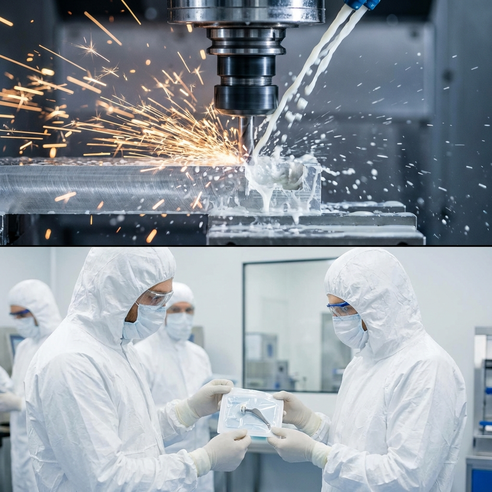

# 📸 Instagram Fixed Posts - Ready to Post

## 1. Identity: Who We Are
**Visual:**

**Caption:**
We are Lifetrek Medical. 👋

More than just manufacturers, we are partners in innovation. With our new acquisition, we've expanded our capacity to serve the world's leading medical device OEMs. 

From prototyping to mass production, we ensure every part meets the highest standards of safety and precision.

#LifetrekMedical #MedTech #MedicalManufacturing #ISO13485 #PrecisionEngineering #MedicalDevice

---

## 2. Capabilities: What We Do
**Visual:**

**Caption:**
Precision at every step. 🔬

Our capabilities are designed to scale with your needs:
✅ Advanced CNC Machining (Swiss Lathe, 5-Axis)
✅ ISO Class 7 Cleanroom Assembly
✅ Sterile Packaging Validation
✅ Full Quality Control (CMM, Vision Systems)

Your design, our production. Let's build it.

#Manufacturing #CNC #Cleanroom #MedDev #QualityControl #ContractManufacturing

---

## 3. Trust: Why Us
**Visual:**

**Caption:**
Your partners in growth. 🤝

In the medical industry, trust is everything. That's why we operate with full transparency and rigorous adherence to ISO 13485 standards. 

We don't just make parts; we solve problems. Whether it's reducing lead times or navigating complex regulatory requirements, Lifetrek is the partner you can rely on.

#BusinessPartnership #SupplyChain #MedTechInnovation #Reliability #Growth
