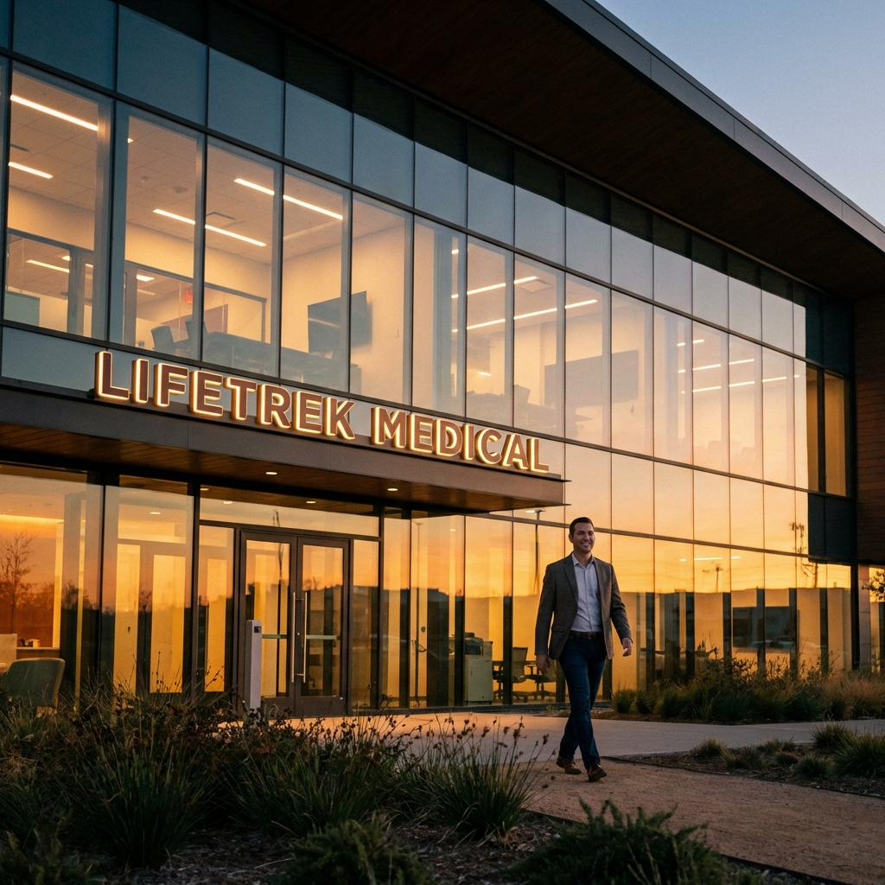
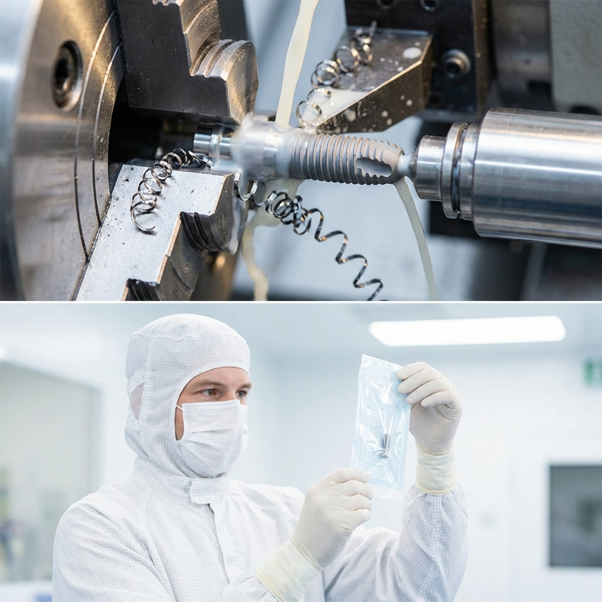
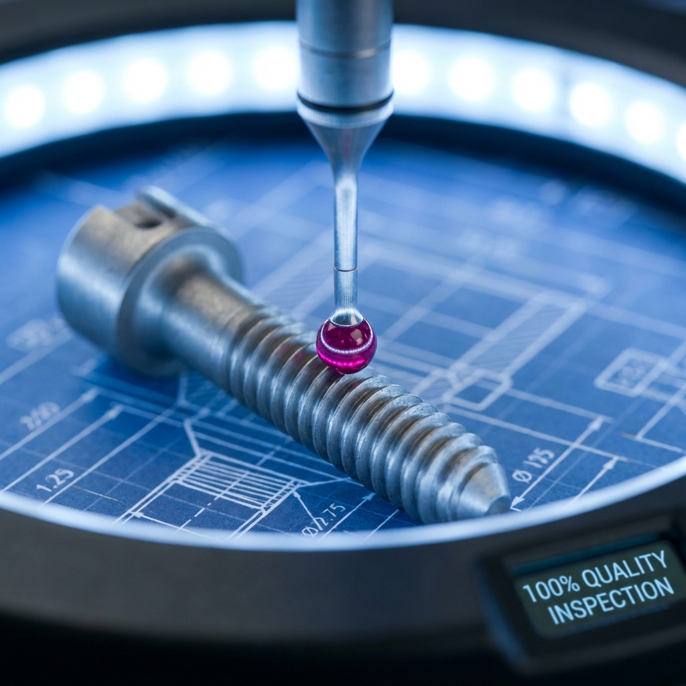

# 📸 Instagram Fixed Posts (Agentic V2)

**Generated by**: Agentic Workflow (Strategist -> Copywriter -> Designer)
**Model Logic**: Based on `generate-linkedin-carousel` prompts.

---

## 1. Identity: The Precision Partner
**Visual:**

**Caption:**
Precision at scale. 🏭

For over 30 years, Lifetrek Medical has been the silent partner behind the world's most critical medical devices. We aren't just a machine shop; we are an extension of your engineering team. 

From Brazil to the world, we deliver ISO 13485 certified excellence for OEMs who cannot afford second-best.

🚀 **Ready to scale your medical device production?** Link in bio.

#LifetrekMedical #MedicalDeviceManufacturing #ISO13485 #MedTech #SwissMachining #ANVISA #GlobalSupplyChain

---

## 2. Capabilities: Print to Pack
**Visual:**

**Caption:**
From raw titanium to sterile package. One partner. 🔄

Why manage 5 suppliers when you can trust one?
🔹 **Swiss Turning**: Complex micro-parts (0.5mm+) on Citizen Cincom machines.
🔹 **5-Axis**: For organic orthopedic geometries.
🔹 **ISO 7 Cleanroom**: Validated cleaning and sterile packaging.

We handle the complexity so you can focus on innovation.

#MedicalManufacturing #SwissLathe #Cleanroom #SterilePackaging #Orthopedics #DentalImplants #SupplyChainOptimization

---

## 3. Trust: The Zero-Defect Standard
**Visual:**

**Caption:**
Quality is not a department. It's our product. 🛡️

In our industry, a micron is the difference between success and failure. That's why every Lifetrek component undergoes rigorous validation:
✅ 100% CMM Inspection
✅ Full Material Traceability
✅ ANVISA & FDA Compliance Support

Sleep soundly knowing your devices are made to the highest global standards.

#QualityControl #CMM #Metrology #PatientSafety #MedicalDevices #ZeroDefect #ContractManufacturing
